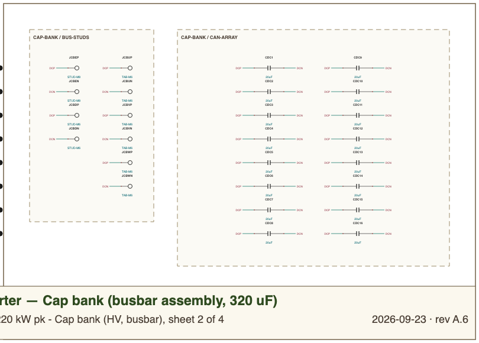
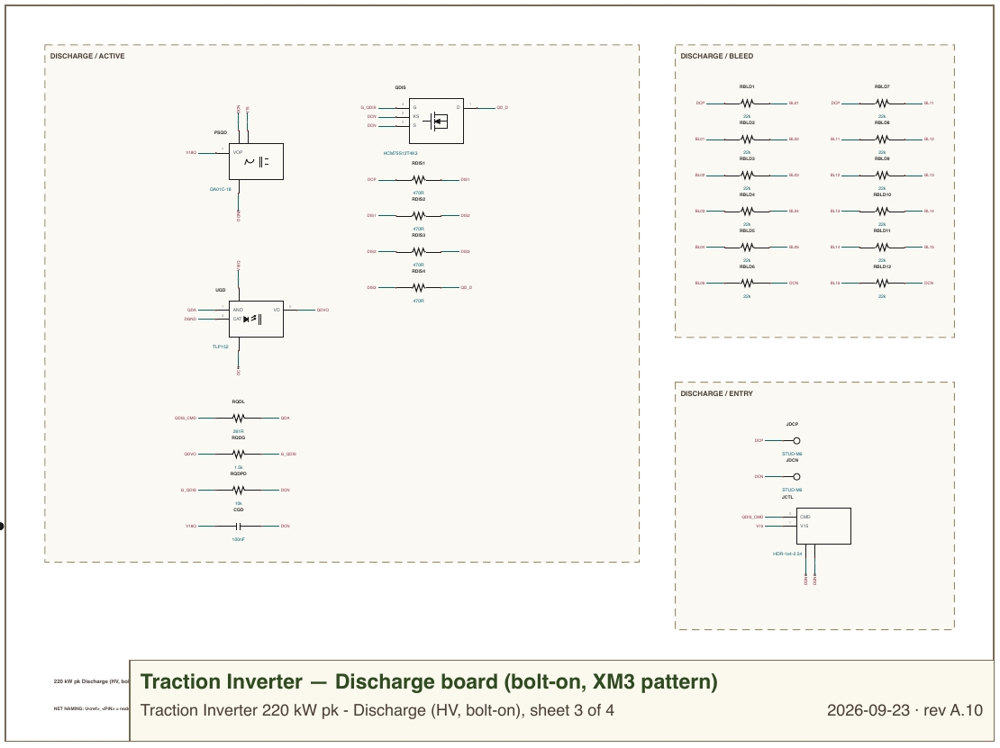
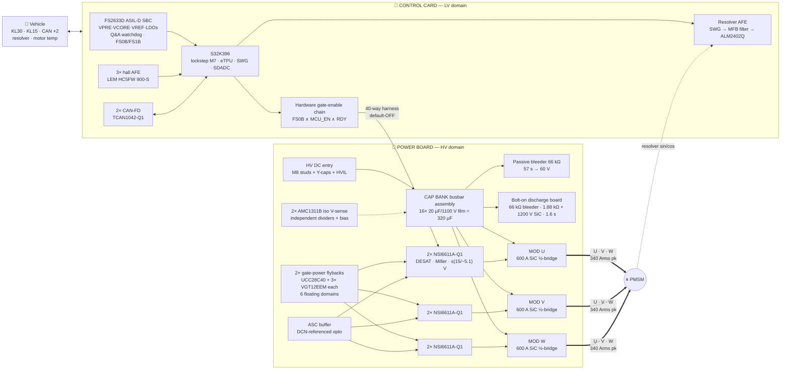
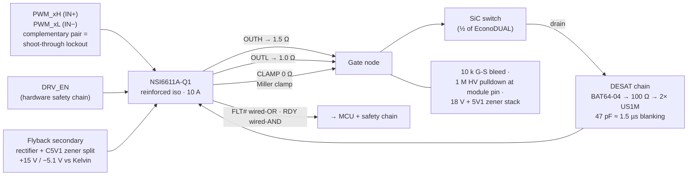
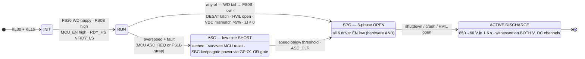
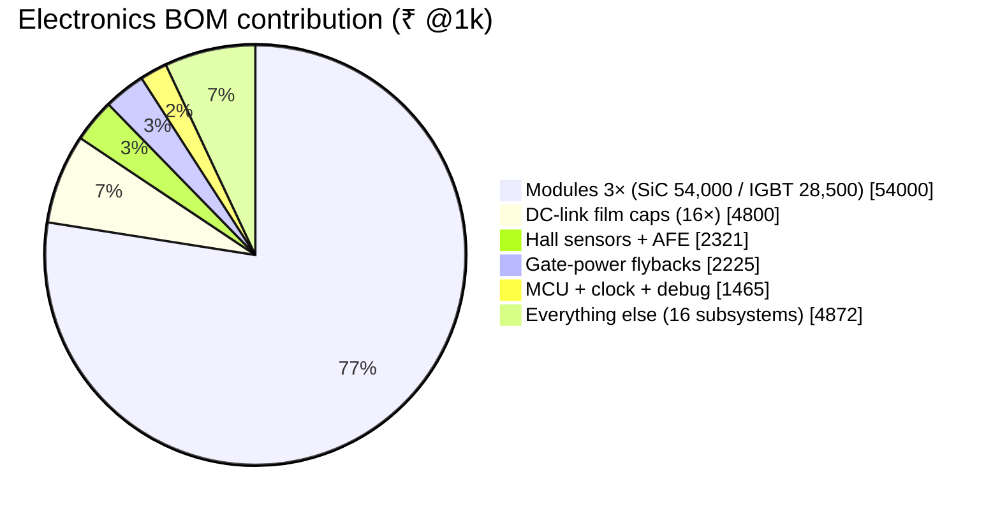
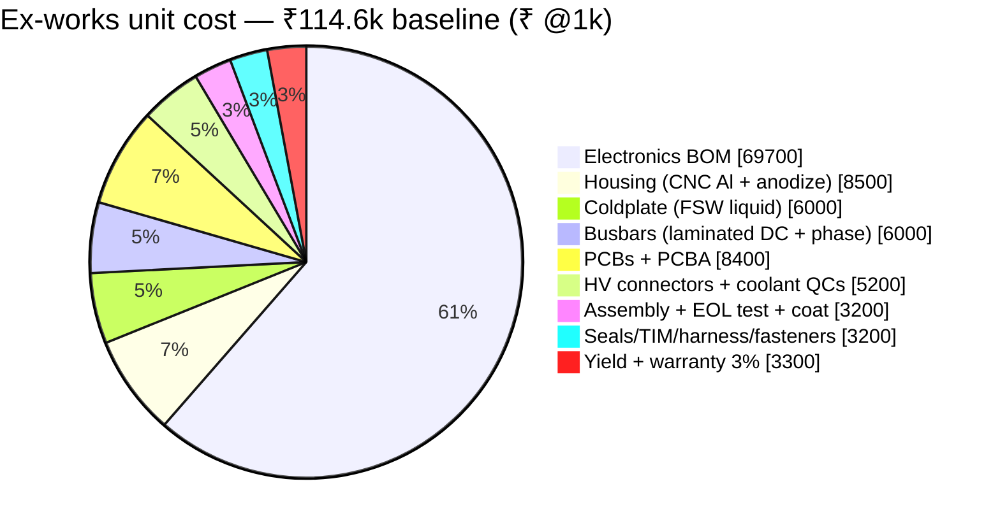
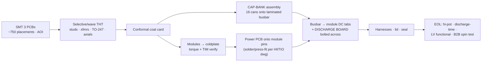
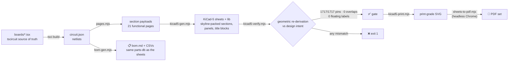
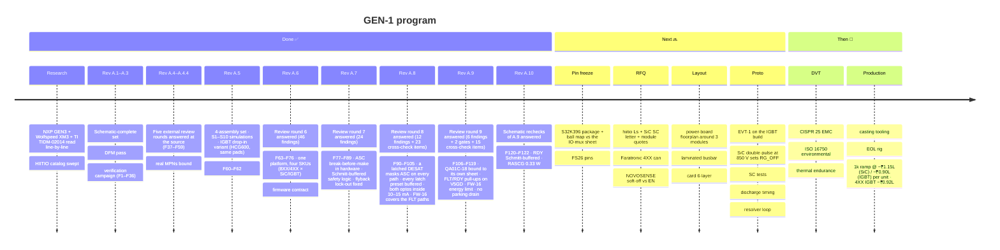

<p align="center">
  
</p>

<p align="center">
  
  
  
  
</p>
<p align="center">
  
  
  
  
  
  
  
  
  
  
  
</p>

<h3 align="center">
  A 220 kW-class, 800 V SiC traction inverter for passenger-EV / commercial drives —<br/>
  engineered to be <b>economical</b>, <b>ASIL-D-capable</b>, and <b>buildable by any competent CEM</b>.
</h3>

<p align="center">
  <a href="#-schematics">Schematics</a> ·
  <a href="#-specifications">Specs</a> ·
  <a href="#%EF%B8%8F-system-architecture">Architecture</a> ·
  <a href="#-functional-safety-asil-d-concept">Safety</a> ·
  <a href="#-dc-link-discharge--checked">Discharge</a> ·
  <a href="#-bom--cost-analysis">BOM & Cost</a> ·
  <a href="#-manufacturing--sourcing">Manufacturing</a> ·
  <a href="#-verification-pipeline">Verification</a> ·
  <a href="#-getting-started">Build</a> ·
  <a href="#-roadmap">Roadmap</a>
</p>

---

## 🎯 What this is

**GEN-1** is a complete, netlist-verified schematic set + costed BOM for a four-assembly traction
inverter, generated from a single **tscircuit** source of truth:

> **Marine Series** (M8 · M10 propulsion cells, ferries to tugs) is a separate product line built
> on this design — see [`marine/README.md`](marine/README.md).


| Board | Domain | Contents | Parts |
|---|---|---|---|
| 🔴 **Power board** | HV (500–850 V) | 3× HIITIO `HCS600FH120D3C1` SiC half-bridges (EconoDUAL™ 3), 6× isolated gate-drive channels, dual gate-power flybacks, 2× isolated V<sub>DC</sub> senses, ASC buffer, HVIL loop | **274** |
| 🟡 **Cap bank** | HV (500–850 V) | Laminated-busbar assembly (not FR4 — it carries the 340 A bus): 16× 20 µF 1100 V film cans = 320 µF, entry lugs, 3× module DC tab pairs, discharge-board studs | **26** |
| 🟠 **Discharge board** | HV (500–850 V) | Bolt-on across the cap bank (XM3 pattern): always-on 66 kΩ passive bleeder + commanded active discharge (1.88 kΩ / 1200 V SiC), default-OFF opto control | **26** |
| 🔵 **Control card** | LV (KL30) | NXP **S32K396** lockstep MCU + **FS2633D** ASIL-D SBC, hardware gate-enable chain, ASC latch, resolver AFE, 3× hall-current AFE, 2× CAN-FD, vehicle interface | **219** |

### 🔗 Interboard links — every one explicit, both ends drawn + ERC-checked

| Link | Carries | Ends (sheet ⇄ sheet) | If it fails |
|---|---|---|---|
| **L1** 40-way harness | gate PWM ×6, faults/RDY, V<sub>DC</sub> + NTC feedbacks, EN/ASC, 15 V bias | `JIC` (power) ⇄ `JICC` (card) | every line default-OFF → gates held low |
| **L2** 4-way discharge link | V15 bias · `QDIS_CMD` · 2× GND | `JDIS` (power) ⇄ `JCTL` (discharge) | opto dark → active path OFF; 66 kΩ bleeder still discharges (57 s) |
| **L3** laminated busbar | DC bus (340 A<sub>rms</sub> class) | `JCBE*` lugs ⇄ HV entry · `JCB[UVW]*` tabs ⇄ module DC terminals · `JCBD*` studs ⇄ `JDCP/JDCN` (discharge) | bolted metal — torque-audited, HVIL opens the loop first |
| **L4** hall harness | 5 V per sensor + 3× current signals | `JLEM` (card) ⇄ 3× LEM HC5FW at the phase outputs | pull-downs → implausible-zero detected by MCU plausibility |
| **L5** HVIL loop | interlock continuity through HV connector | `JHVIL` (power) ⇄ loop ⇄ card monitor | open = V<sub>DDIO</sub>/2 signature → controlled discharge |

Same net name on two sheets means **one net, joined only at the named connector/stud/tab** —
the rule is printed in every sheet's NET NAMING panel, and `erc-audit.mjs` asserts both ends
of every link pin-by-pin (the 40-way map alone is 80 assertions).
The design leans on three production references, read line-by-line: NXP **EV-INVERTERGEN3**
(control architecture, adopted almost verbatim), Wolfspeed **CRD300DA12E-XM3** (discharge +
gate-drive practice), and TI **TIDM-02014** (safety decomposition patterns).

> [!IMPORTANT]
> **Supply position:** the four power-silicon pieces (3 modules + discharge FET) come through
> a **direct HIITIO relationship**. Everything else on the BOM is LCSC-stocked or one
> ships-today DigiKey basket — verified line-by-line in two live sourcing sweeps.

---

## 📐 Schematics

The complete drawing set, one sheet per board — dashed functional sections, net-label-only
cross-section wiring, sheet index + net-naming + safety panels, self-identifying title blocks.

**➡️ Open the PDF set: [`boards/out-pdf/`](boards/out-pdf/) · Import into EasyEDA Pro / KiCad 5: [`kicad5/Traction-Inverter-SHIP.zip`](kicad5/Traction-Inverter-SHIP.zip)**

| Sheet 1 — Power board (HV) | Sheet 4 — Control card (LV) |
|---|---|
| [](boards/out-pdf/) | [](boards/out-pdf/) |

| Sheet 2 — Cap bank (busbar assembly) | Sheet 3 — Discharge board (bolt-on) |
|---|---|
| [](boards/out-pdf/) | [](boards/out-pdf/) |

Every sheet carries its own review panels — the ASIL-D concept and the discharge verification
are printed **on the drawing**, so the schematic is never the only artifact a reviewer holds:

<p align="center"></p>

---

## ⚡ Specifications

<table>
<tr><td valign="top" width="50%">

### Ratings

| Parameter | Value |
|---|---|
| DC-link voltage | **500 – 850 V** (700 V nom) · 4XX SKUs **250 – 500 V** |
| Peak power | **220 kW** / 30 s from 654 V (168 kW at 500 V; 4XX 150 kW from 379 V) |
| Continuous power | **120 kW** from 656 V (4XX 90 kW) |
| Peak phase current | **340 A<sub>rms</sub>** (480 A pk) |
| Continuous phase current | 185 A<sub>rms</sub> |
| Semiconductor efficiency (continuous point) | **SiC 99.0 %** · **IGBT 98.6 %** |
| DC feed current | 314 A pk / 171 A cont |
| Switching frequency | **SiC** 8–10 kHz · **IGBT** 5 kHz |
| Motor type | 3-φ PMSM, resolver feedback |
| Cooling | Liquid coldplate @ 65 °C |
| Ambient | −40 … +85 °C |

</td><td valign="top" width="50%">

### Key silicon

| Function | Part | Grade |
|---|---|---|
| Power switch ×3 | HIITIO **HCS600FH120D3C1** (SiC) *or* **HCG600FH120D3E1EA** (IGBT) — same pads & pins | EconoDUAL 3 |
| Gate driver ×6 | **NSI6611A-Q1** 10 A iso, DESAT + Miller | AEC-Q100 |
| MCU | NXP **S32K396** lockstep M7 | ASIL-D |
| Safety SBC | NXP **FS2633D** | ASIL-D |
| V<sub>DC</sub> sense ×2 | **AMC1311B** reinforced iso | — |
| Phase current ×3 | LEM **HC5FW 900-S** hall | 900 A |
| Resolver driver | **ALM2402Q-Q1** | AEC-Q100 |
| CAN-FD ×2 | **TCAN1042HGV-Q1** | AEC-Q100 |

</td></tr>
</table>

<details>
<summary><b>📏 Sizing math (click to expand)</b> — why every number above closes</summary>

| Check | Calculation | Result |
|---|---|---|
| Max line-line voltage | V<sub>ll</sub> = 0.95 · V<sub>dc</sub>/√2 (linear SVPWM, 5 % reserve) | 470 V<sub>rms</sub> at 700 V |
| Power available | √(3/2) · 0.95 · V<sub>dc</sub> · 340 A · PF 0.85 | 235 kW at 700 V — 220 kW needs ≥ 654 V (FW-03) ✅ |
| Per-switch conduction, SiC peak | ½ · I<sub>rms</sub>² · R<sub>DS,hot</sub> = ½ · 340² · 5.7 mΩ (synchronous bridge) | 329 W |
| Per-switch switching + Q<sub>rr</sub> + dead time @850 V/10 kHz | DS energies at the drawn 3.3/6.8 Ω, ∝ V · I | 225 W |
| Per-switch total, 30 s peak / continuous | `loss-model.mjs` (SiC; IGBT build in `docs/variants.md`) | 554 W / 200 W → T<sub>j</sub> 125 °C (S4; 135 °C with no plate mass) / 90 °C ✅ |
| Voltage utilization | 850 V / 1200 V; turn-off overshoot is the DPT gate (S8) | 71 % ✅ |
| DC-link ripple current | I<sub>c,rms</sub> ≤ 0.65 · I<sub>ph</sub> (worst M/cosφ, Kolar) | 221 A pk (13.8 A/can) / 120 A cont |
| Link capability | 16 cans × 15.4 A (C3D, 10 kHz/70 °C) | 246 A ✅ |
| Stored energy @850 V | ½ · 320 µF · 850² | **116 J** |
| Gate power per switch (SiC) | Q<sub>g</sub> · ΔV · f = 1.09 µC · 20.5 V · 10 kHz | 0.22 W ✅ |
| Hall range | ±900 A vs 481 A pk | 1.9× headroom ✅ |

Full derivations: [`docs/design-basis.md`](docs/design-basis.md)

</details>

---

## 🏗️ System architecture



<details>
<summary><b>🔌 One gate-drive channel in depth</b> (×6 on the board)</summary>



Values carried from the GEN3/XM3 references; `R_g` tuned at double-pulse test.

</details>

---

## 🛡 Functional safety (ASIL-D concept)

The safe state is **3-phase-open**; above the motor's crossover speed it is **ASC** (active
short via the low side). The fast paths — watchdog → FS0B, DESAT → fault latch, the enable AND
chain, the ASC latch — are **hardware**; HVIL, V<sub>DC</sub> and ΣI plausibility are firmware
([`docs/firmware-contract.md`](docs/firmware-contract.md), including the fault × speed
safe-state matrix).



<details>
<summary><b>🔟 The ten hardware mechanisms (decomposition table)</b></summary>

| # | Mechanism | Independence argument |
|---|---|---|
| 1 | Lockstep **S32K396** (ASIL-D core) runs the torque path | — |
| 2 | **FS26 Q&A watchdog** + rail monitors → **FS0B** | Separate silicon, zero software |
| 3 | FS0B ∧ MCU_EN ∧ RDY **hardware AND** → all 6 driver enables | Discrete 74LVC1G11-Q100 gates |
| 4 | **FS1B strap → latched LS-ASC select** (HS strapped OFF) | SBC-commanded, survives MCU reset |
| 5 | Flyback enables **OR-gated (MCU ∨ FS26-GPIO1)** | SBC alone keeps gate power for ASC |
| 6 | 3× hall current + **ΣI = 0 plausibility** | 3rd channel = built-in redundancy |
| 7 | **2× isolated V<sub>DC</sub>** senses, >5 % ⇒ fault, shared offset monitored | Separate dividers, amps + bias; receivers share VREF5 (monitored — A.6) |
| 8 | Per-switch **DESAT** (≤1.9 µs to detect on SiC, latching) → global latch delayed past the soft turn-off | Different technology vs halls |
| 9 | **HVIL** ladder — open = V<sub>DDIO</sub>/2 signature | MCU ADC (firmware, ≤100 ms) |
| 10 | **Default-OFF pulldowns** on every harness-floatable line | Passive |

> The architecture implements the NXP GEN3 / TI TIDM-02014 pattern. A formal ASIL-D *claim*
> additionally needs the ISO 26262 work products (HARA, FMEDA, DFA) — out of schematic scope;
> the hardware those analyses lean on is all present. In parts, the entire safety chain costs **₹37**.

</details>

---

## 🔻 DC-link discharge — checked

Both references ship only a passive bleeder; GEN-1 keeps that network **and** adds a
default-OFF active path for the ≤2 s crash case — then *verifies* it. The whole network rides
its own **bolt-on discharge board** (sheet 3 of 4) mounted across the cap-bank busbar
(sheet 2), the XM3 pattern: the stored energy and its bleeder are one assembly.


| Path | Network | τ | 850 → 60 V | Stress per resistor |
|---|---|---|---|---|
| **Passive** (always on) | 12× 22 kΩ 2512 2 W, 6s×2p = 66 kΩ | 21.1 s | **56.5 s nom / 65.3 s worst** ✅ | 0.96 W (48 %) · 154 V worst-tolerance (77 % of 200 V) |
| **Active** (commanded) | 4× 470 Ω 10 W fail-open wirewound + SiC FET = 1.88 kΩ | 0.60 s | **1.57 s nom / 1.81 s worst** ✅ (≤2 s crash · 5 s R100) | 31 J worst pulse (≥100 J rated) · 213 V |

4XX SKUs use the same discharge PCB with 4 × 220 Ω and 12 × 15 kΩ (1.70 s / 88 s worst).

> [!WARNING]
> **Rule printed on sheet 1:** never energize without the passive bleeder network fitted.

---

## 📊 BOM & cost analysis

Four SKUs of the same boards, one parts-db (the sheets, BOMs and LCSC fields cannot
disagree, and every BOM fails if a printed value disagrees with its MPN) — platform and
business case: [`docs/variants.md`](docs/variants.md):

| SKU | Electronics BOM @1k | Ex-works unit | Per peak kW | Suggested price (35–40 % GM) |
|---|---|---|---|---|
| **8XX SiC** (HCS600) | **₹70,965** → [`bom.md`](docs/bom.md) | ≈ ₹1.15 L | ₹525/kW | ₹1.75–1.95 L |
| **8XX IGBT** (HCG600) | **₹45,465** → [`bom-igbt.md`](docs/bom-igbt.md) | ≈ ₹0.90 L | ₹410/kW | ₹1.35–1.55 L |
| **4XX IGBT** (HCG600, 150 kW) | **₹45,465** → [`bom-igbt4.md`](docs/bom-igbt4.md) | ≈ ₹0.92 L | ₹610/kW | per-kW for its segment |
| 4XX SiC (on request) | ₹70,965 → [`bom-sic4.md`](docs/bom-sic4.md) | ≈ ₹1.17 L | ₹780/kW | — |

602 components · 191 lines · zero unmatched · per-board CSVs alongside each BOM.



**The Pareto is extreme by design:** 19 components carry 84 % of the cost — concentrated in
*quotable, second-sourced* lines — while the ~470-part long tail is LCSC-basic jellybeans.
The complete 6-channel isolated gate drive is ₹656; the whole ASIL-D safety chain is ₹37.

<details>
<summary><b>📈 Full subsystem Pareto (21 rows)</b></summary>

| Subsystem | ₹ @1k | Share | Cumulative | Parts |
|---|---|---|---|---|
| SiC power modules | 54,000 | 77.5 % | 77.5 % | 3 |
| DC-link film caps | 4,800 | 6.9 % | 84.4 % | 16 |
| Hall sensors + AFE | 2,321 | 3.3 % | 87.7 % | 34 |
| Gate-power flybacks | 2,225 | 3.2 % | 90.9 % | 63 |
| MCU + clock + debug | 1,465 | 2.1 % | 93.0 % | 22 |
| Vehicle connector + protection | 785 | 1.1 % | 94.1 % | 6 |
| Gate drivers + networks | 656 | 0.9 % | 95.1 % | 120 |
| Discharge (active + passive) | 630 | 0.9 % | 96.0 % | 21 |
| Module snubbers | 540 | 0.8 % | 96.8 % | 3 |
| FS26 SBC + LV input + wake | 527 | 0.8 % | 97.5 % | 27 |
| V<sub>DC</sub> iso sensing + bias | 340 | 0.5 % | 98.0 % | 21 |
| Resolver AFE | 269 | 0.4 % | 98.4 % | 48 |
| Harness + pulldowns | 246 | 0.4 % | 98.7 % | 17 |
| LV power (prot + LDO + boost) | 236 | 0.3 % | 99.1 % | 24 |
| HV entry / Y-caps / HVIL / studs | 188 | 0.3 % | 99.3 % | 14 |
| ASC buffer | 139 | 0.2 % | 99.5 % | 7 |
| CAN-FD ×2 | 132 | 0.2 % | 99.7 % | 14 |
| Temps (module/board/motor) | 82 | 0.1 % | 99.9 % | 24 |
| V<sub>DC</sub> receivers (card) | 61 | 0.1 % | 99.9 % | 12 |
| Safety chain (EN/ASC/ILK) | 37 | 0.1 % | 100.0 % | 21 |
| Module NTC routing | 4 | 0.0 % | 100.0 % | 9 |

</details>

### 💰 Full unit cost @1,000 units



| | Low | **Baseline** | High |
|---|---|---|---|
| Ex-works cost / unit | ₹99.9k | **₹114.6k (~$1,380)** | ₹150.9k |
| ₹/kW | 454 | **521 ($6.3/kW)** | 686 |
| 1,000-unit build | ₹10.0 Cr | **₹11.5 Cr** | ₹15.1 Cr |
| Suggested ex-works price (35–40 % GM) | | **₹1.75–1.95 L (~$2,200)** | |

The two lines that move everything: the **HIITIO module quote** (47 % of unit cost) and the
**film-cap quote**. Comparable imported units (Cascadia CM350 class) sell at $4,000–7,000.
Detail + NRE table: [`docs/cost-rollup.md`](docs/cost-rollup.md)

---

## 🏭 Manufacturing & sourcing

Rev A.2 was a dedicated DFM pass, driven by **two live sourcing sweeps** (every specific MPN
checked on LCSC; misses re-checked on DigiKey/Mouser with LCSC alternates). Result — five
sourcing tiers, nothing single-channel outside the anchors:

| Tier | What | Lines | Channel |
|---|---|---|---|
| 🤝 **T1 Direct** | 3× SiC module + discharge FET | 4 | HIITIO (relationship in place) |
| 🏛 **T2 Franchise** | S32K396 · FS2633D · 3× LEM hall | 5 | NXP/LEM — **order first, longest lead** |
| 📦 **T3 DigiKey ships-today** | VGT12EEM ×6 · TE 770669-1/770680-1 · 10 W wirewounds · Murata MGJ2 ×2 (PO cert gate) · Coilcraft XAL ×3 · BUK7Y14-80E ×2 · NCV4276C ×3… | ~20 | one consolidated order |
| ✅ **T4 LCSC-verified** | ~60 lines *with live C-numbers* — incl. automotive grades of NSI6611A-Q1, AMC1311B, ALM2402Q-Q1, TCAN1042-Q1, TPS55340-Q1, OPA348-Q1, 74LVC1G11-Q100H, Faratronic link caps | ~60 | LCSC / JLC |
| 🧂 **T5 Jellybeans** | 0603+ passives, zeners, SS34, 2N7002… | ~440 | LCSC basic |



<details>
<summary><b>🔧 The seven DFM design changes (running log)</b></summary>

| # | Change | Why | Effect |
|---|---|---|---|
| 1 | Flyback controller **NJW4140 → UCC28C40DR** + 2-transistor default-OFF enable clamp | Nisshinbo part had 0–2 pcs on LCSC; the C43 grade cannot start at 9 V crank (F31) | Also **caught a latent bug**: the aux-only VCC could never start — trickle-start added |
| 2 | DC link **8× 40 µF → 16× Faratronic 20 µF/1100 V** (C2840809) | No 40 µF/1100 V can exists on LCSC in any brand | **−₹2.8k**, better ripple spread; TDK B32778 stays drop-in alt |
| 3 | Bleeder **9× TE CRGP (500 V specialty) → 10× generic 27 k 2512 2 W** 5s×2p | TE part is TTI-only in volume | 170 V/resistor inside standard ratings — any vendor builds it |
| 4 | Resolver driver **confirmed ALM2402Q-Q1** (LCSC C544754) | Sweep found the GEN3-exact part in stock | No redesign |
| 5 | **Value consolidation** 4.99k→5.1k · 49.9k→51k · 12.1k→12k · 0402→0603 | Fewer feeders, JLC-basic, easier rework | Firmware-calibrated scalings unaffected |
| 6 | Vehicle connector → **TE 770669-1** 23-pos AMPSEAL header + 770680-1 plug | 776231-1 turned out to be the **35-pos** header (its own TE drawing, F60) | DigiKey-stocked, sealed automotive |
| 7 | Flyback switch **BUK9Y14 → BUK7Y14-80E**; clamp TVS SMAJ13A; both 10 µH → one XAL4040-103 line | Logic-level ±10 V gate was illegal at the 11.8 V drive (F56) | Same LFPAK56; zener now dark in normal operation |

Full plan incl. layout-phase DFM rules and proto-vs-production grade policy: [`docs/dfm.md`](docs/dfm.md)

</details>

---

## 🔬 Verification pipeline

Everything on this repo is **generated and gated** — the drawing set ships only at 100 %.



Four independent verification layers — each with its own tool, none trusting the others:

| Layer | Tool | What it proves | Result |
|---|---|---|---|
| Sheets ⇄ netlist (geometry) | `kicad5-verify.mjs` | every drawn pin lands on its intended net | **1815/1815 · 100 %** |
| Netlist ⇄ intent (structure) | `erc-audit.mjs` | pairing, chain topology, polarity, rails, floats, a lock-in per fixed finding | **891 checks · 0 fail** |
| Numbers ⇄ physics (worst case) | `design-verify.mjs` + `loss-model.mjs` | losses, thermal, envelope, discharge, protection timing, tolerances — **every SKU** | **108 PASS · 14 WARN · 0 FAIL** (each WARN names its bench/vendor gate) |
| Circuits ⇄ time/frequency domain | `sim-verify.mjs` | S1–S10: flyback start-up (cycle-by-cycle), boost Bode, SVPWM ripple, 30 s thermal per SKU, discharge ODE, current-loop PM per f_sw, overshoot budget, DESAT timeline, ASC hold-up | **23 PASS · 6 WARN · 0 FAIL** → [simulation-report](docs/simulation-report.md) |
| BOM ⇄ netlist (values) | `bom-gen.mjs` | every class MPN encodes the value the BOM prints; nothing is published unless the whole set validates | **0 mismatches, 4 SKUs** |

### 🔍 The review campaign — eight external rounds, every claim verified at the source

An independent reviewer ran five adversarial rounds against the released PDFs. The working
rule throughout: **no fix without primary-source verification, no rebuttal without evidence**
— every claim was checked against the manufacturer datasheet (winding diagrams read at
300 dpi where the dots decided it) before a single edit. Findings log **F1–F122, all closed**;
each round's full narrative lives in [`docs/design-basis.md`](docs/design-basis.md) §11.
Round six (46 findings) is answered line by line in
[`docs/review-A6-disposition.md`](docs/review-A6-disposition.md), and round seven (24 findings)
in [`docs/review-A7-disposition.md`](docs/review-A7-disposition.md), round eight (12 findings plus a 23-item cross-check of the fixes) in
[`docs/review-A8-disposition.md`](docs/review-A8-disposition.md), round nine in
[`docs/review-A9-disposition.md`](docs/review-A9-disposition.md), and the A.9 schematic rechecks in
[`docs/review-A10-disposition.md`](docs/review-A10-disposition.md). Every contested number was
recomputed by an independent second model.

| Round | Release | Fixed | The headline catches |
|---|---|---|---|
| Self campaign | A.3 | 18 defects (F1–F36) | a gate supply that could never start; ASC drive over the driver's GND2+6 V abs max; discharge string missing the crash corner |
| Review 1 | A.4 | 10 (F37–F46) | **transformer secondary phasing** (forward-mode ≈35 V into +22 V-abs gates), DESAT clamp direction, raw KL15 into the MCU, unsourced gate-power feeds, hardware fault latch added, every symbol rebound to real package pins |
| Review 2 | A.4.1 | 5 (F47–F51) | **AMC1311 IN/SHTDN swapped on both channels** (inputs grounded), FS26 TRKIN was the VREF supply — not a ground-able spare, TPS55340 pin 5 is SYNC (7 V abs), V15 post-regulator vs boost pass-through |
| Review 3 | A.4.2 | 6 (F52–F57) | FS26 buck passives to Table-106, **CAN chokes wound 1-4/2-3** (CANH crossed onto CANL), ALM2402 behind its own LDO, **BUK7Y14-80E** (±20 V gate) |
| Review 4 | A.4.3 | 2 (F58–F59) | LCOR value/MPN/BOM/OTP agreement, UB15 compensation network (was ~0° screening margin) |
| Review 5 | A.4.4 | procurement | real MPNs bound; **RECOM R15P05S rejected** — 6.4 kV is a 1 s test, insulation grade *basic*; FS26 OTP table pinned (§8a) |
| Docs audit | A.5 | 3 (F60–F62) | JVEH rebound to the true 23-pos AMPSEAL **770669-1** (the TE drawing proved 776231-1 is 35-pos); QA01C rails read as **+20/−4 V** (the base part's sheet — corrected to the fitted QA01C-18, +18/−3 V, in A.9) — clamps re-verified |
| Review 6 | A.6 | 14 (F63–F76) | S8 overshoot **1000× unit error** (SiC turn-off now 6.8 Ω, DPT-gated); SiC conduction formula 2.4× low; IGBT SC is **6 µs** not 10 (blanking 82 pF); gate supply **never started at 9 V** (0.4 V UVLO hysteresis — 47 µF + 18 V clamp); BOM MPNs that would have re-created F40/F52; proposed "fault-dominant latch" **rejected** (deadlocks the NSI6611 FLT reset) — one-shot clear + soft-off delay instead |
| Review 7 | A.7 | 13 (F77–F89) | RC timing nodes into non-Schmitt LVC inputs at **63,500 ns/V** (Schmitt buffer); **ASC entry had no break-before-make** (12 nF LS delay; the MCU path holds ASC as PWM-ASC with EN high, because the NSI6611 honours DESAT over ASC only then — found by the round's own cross-check); flyback **locked out at high KL30** (own sense rectifier); FS1B loaded past its V_OL and FAULT_OUT made sink-only; 25 V caps on a 33 V node; ASC opto under its guaranteed turn-on current (self-found); +₹57/unit |
| Review 8 | A.8 | 16 (F90–F105, incl. its cross-check) | **a DESAT during latched ASC left the healthy low sides on** — the faulted driver holds itself off (NSI6611 Fig. 8.11) but only a ₹5 AND gate (ASC = latch AND no-FLT) guarantees SPO on every path; last slow latch preset buffered (FLT diode-OR now Schottky for the Schmitt threshold); discharge opto under-driven like the ASC one; boot self-test masked by RDY; FAULT_OUT battery-short clamp moved off the logic rail; atomic BOM publish; S4 junction path made static. Cross-check of the fixes: FW-15 always clears ASC, FW-16 on measured no-HV conditions with FS_GPIO1 and FLT-injection steps, dead-buffer pulls, 261 Ω LEDs inside 10–15 mA, B5V6 clamp, discharge header V15-GND-CMD-GND, ERC locks by net and MPN; +₹18/unit |
| Review 9 | A.9 | 14 (F106–F119, incl. its cross-check) | **the ASC/discharge bias modules were modelled from the wrong datasheet** (QA01C-18 is +18/−3 V, not +20/−4 V) — timing re-derived, discharge gate given a 1.5 k divider; **FLT/RDY pulled above the drivers' VCC1 rating** — pull-ups moved to V5GD on a harness pin; self-test energy-limited; RFS4 made anti-surge; self-found **≈150 mA parking drain** removed with one card-side P-FET. Cross-check of the fixes: V5GD read on an ADC pin (a dead V5GD faked a 0 V bus), harness re-laid for both dual-row numberings, resolver LDO sleeps too, QLVS slew-limited, DESATs kept in NVM; +₹29/unit |
| Review 10 | A.10 | 3 (F120–F122) | schematic-only rechecks of A.9 kept every correction; **RDY lines drove the AND gates at 20–100 ns/V against a 10 ns/V limit** — third Schmitt buffer (reverses a round-7/8 rejection); RASCG given a 0.33 W part; sheet and wording fixes; +₹11/unit |

Three review claims were **rebutted with evidence** (900 V divider corner — system max is
850 V on a 0.1 % bottom leg; the GEN3-exact resolver monitor asymmetry; the discharge math —
it matches), and two review narratives were corrected in our own records at the reviewer's
insistence (CBOOT_PRE 100 nF was legal; VCC1 loss is a single-point failure whose outcome is
three-phase-open with ASC still commandable).

Full findings log + margin tables: [`docs/verification-report.md`](docs/verification-report.md).

| Metric | Power | Cap bank | Discharge | Card | Total |
|---|---|---|---|---|---|
| Components | 295 | 26 | 26 | 255 | **602** |
| Functional sections | 24 | 2 | 3 | 26 | 55 |
| Net labels / pin stubs | 813 | 42 | 59 | 803 | 1,717 |
| Sheet size | 44.6″ × 28.6″ | 8.1″ × 5.8″ | 11.1″ × 7.8″ | 44.6″ × 25.3″ | 4 sheets |

---

## 🔁 One platform, four SKUs — SiC or IGBT, 8XX or 4XX, same boards

The cap bank and discharge were already bolt-on assemblies, and the hiitio SiC (HCS600) and
IGBT (HCG600) modules share the D3 outline and 11-pin map — so **one power PCB, one control
card, one discharge PCB and one busbar drawing build every SKU**. A SKU is a module, a film-
can choice, a few values on existing pads, an identity resistor and a firmware parameter set.

| | 8XX SiC | 8XX IGBT | 4XX IGBT |
|---|---|---|---|
| Bus / f_sw | 500–850 V · 8–10 kHz | 500–850 V · 5 kHz | 250–500 V · 5 kHz |
| Peak / continuous | 220 / 120 kW (from 654 V) | 220 / 120 kW (from 654 V) | 150 / 90 kW (from 379 V) |
| Tj end of 30 s peak (S4; static-plate bound 135 / 142 / 133 °C) | 125 °C / 175 °C | 132 °C / 150 °C | 125 °C / 150 °C |
| Deltas vs SiC | — | module, DESAT 4.7 k/82 pF, gate 1.0/1.0 Ω, RT 8.2 k | as IGBT + 16 × 50 µF/600 V cans, discharge 220 Ω / 15 k |
| BOM @1k | ₹71,080 | ₹45,580 | ₹45,580 |

Recommendation (business case in [`docs/variants.md`](docs/variants.md)): lead with 8XX (same
hardware, best ₹/kW), make IGBT the volume SKU at both voltages, keep SiC as the premium 8XX,
bring up EVT-1 on the IGBT build. 220 kW at 400 V needs ≈560 A rms — a same-pin-map 900 A
module plus larger sensors and cap bank, not a new board. Generate: `npm run bom:all`.

---

## 🧪 Simulation — the drawn circuits at their operating points

`calculations/sim-verify.mjs` numerically simulates the released netlist's circuits in the
time and frequency domain on the shared loss model (`loss-model.mjs`). **23 PASS · 6 WARN ·
0 FAIL** — full table with per-row modeling assumptions: [`docs/simulation-report.md`](docs/simulation-report.md).

| # | Simulation | Key result (rev A.10) |
|---|---|---|
| S1 | Gate-power flyback: drain stress + **cycle-by-cycle start-up** | one burst to the rails in **73–240 ms** at KL30 9–14 V, every corner (FB now on its own aux rectifier — A6-R07); the A.5 values never started at 9 V |
| S2 | UB15 boost loop Bode (A.4.3 compensation) | f_c 1.9–2.5 kHz, **PM 72–75°** |
| S3 | DC-link ripple, center-aligned SVPWM, swept M/cosφ | worst **0.65·I**: 13.8 A/can at 340 A (15.4 A rating); 4XX 16.2 A/can (18 A) |
| S4 | 30 s thermal transient per SKU, from continuous steady state | **125 / 132 / 125 / 133 °C** (8XX SiC / 8XX IGBT / 4XX IGBT / 4XX SiC; IGBT and diode share the coldplate — RR07; junction and case taken static — R7-07; with no plate mass at all 135 / 142 / 133 / 143 °C, the 8XX IGBT a WARN until the thermal test — R8X-11) |
| S5 | Discharge ODE, bleeder counted once | **1.57 s nom / 1.81 s worst** (8XX), 1.70 s (4XX) |
| S6 | Current-loop phase margin per f_sw | ceilings **1.39 / 1.15 / 0.76 kHz** at 10 / 8 / 5 kHz |
| S7 | Gate peak current (DS §9.6) | SiC 3.1/2.5 A · IGBT 5.6/10 A vs the 10 A driver |
| S8 | SiC turn-off overshoot budget at 850 V/481 A (DS fall time) | 7.8 nH at 3.3 Ω cold → **13.6 nH at 6.8 Ω cold**, 22.9 nH hot — **DPT gate** |
| S9 | DESAT reaction, worst corners | SiC **3.1 µs** (tSC unpublished → vendor letter) · IGBT **4.8 µs at 400 mA / 10.1 µs at the 100 mA DS minimum** vs the 6 µs rating → release gate (RR04) |
| S10 | ASC hold-up through total LV loss | **0.5–3.1 ms** (was quoted 15 ms; round 7 starts the worst case at the 13.54 V low-corner rail) → sustained ASC requires KL30; motor rule in the contract |

| | |
|---|---|
|  |  |
|  |  |
|  |  |

<p align="center"></p>

Hardware-only items are named per-row as bench gates (layout parasitics, core saturation,
SiC short-circuit withstand, EMI) — simulated claims and measured claims are never mixed.

---

## 🚀 Getting started

```bash
npm install
```

```bash
npm run build     # tscircuit netlists  → dist/boards/*/circuit.json
```

```bash
npm run sheets    # pages → KiCad5 sheets → 100% pin-verify → SVG → PDFs  (needs Chrome)
```

```bash
npm run bom       # docs/bom.md + per-board CSVs
```

### 📁 Repository map

| Path | What lives there |
|---|---|
| [`boards/power.tsx`](boards/power.tsx) · [`boards/capbank.tsx`](boards/capbank.tsx) · [`boards/discharge.tsx`](boards/discharge.tsx) · [`boards/control-card.tsx`](boards/control-card.tsx) | **Source of truth** — the four assembly netlists |
| [`packages/cells.tsx`](packages/cells.tsx) | Parameterized cells: gate-drive channel, flyback chain, iso V-sense, hall AFE, CAN, 40-way harness map |
| [`calculations/parts-db.mjs`](calculations/parts-db.mjs) | Designator→MPN/LCSC/price/alt database + on-sheet safety/discharge panel text |
| [`calculations/*.mjs`](calculations/) | The generator pipeline (pages · kicad5-gen · verify · print · pdf · bom) · `loss-model.mjs` = the one SKU table + loss model both verifiers use |
| [`boards/out-pdf/`](boards/out-pdf/) | 📄 Rendered PDF schematic set |
| [`kicad5/`](kicad5/) | EasyEDA-Pro/KiCad-5 importable sheets + `Traction-Inverter-SHIP.zip` |
| [`docs/design-basis.md`](docs/design-basis.md) | Ratings, sizing math, safety concept, references |
| [`docs/dfm.md`](docs/dfm.md) | Manufacturability plan + sourcing tiers |
| [`docs/bom.md`](docs/bom.md) · [`bom-igbt.md`](docs/bom-igbt.md) · [`bom-igbt4.md`](docs/bom-igbt4.md) · [`bom-sic4.md`](docs/bom-sic4.md) | Generated BOMs, all four SKUs, with subsystem Pareto |
| [`docs/variants.md`](docs/variants.md) | The platform: four SKUs on one set of boards, economics, recommended launch path |
| [`docs/firmware-contract.md`](docs/firmware-contract.md) | Hardware → firmware contract: SKU identity, envelope, protection allocation, safe-state matrix, fault-latch recovery |
| [`docs/review-A10-disposition.md`](docs/review-A10-disposition.md) · [`.csv`](docs/review-A10-disposition.csv) | Review round 10 (schematic rechecks of A.9): every finding classified, verified and dispositioned |
| [`docs/review-A9-disposition.md`](docs/review-A9-disposition.md) · [`.csv`](docs/review-A9-disposition.csv) | Review round 9: every finding classified, verified and dispositioned |
| [`docs/review-A8-disposition.md`](docs/review-A8-disposition.md) · [`.csv`](docs/review-A8-disposition.csv) | Review round 8 and its cross-check: every finding classified, verified and dispositioned |
| [`docs/review-A7-disposition.md`](docs/review-A7-disposition.md) | Review round 7: every finding classified, verified and dispositioned |
| [`docs/review-A6-disposition.md`](docs/review-A6-disposition.md) | Review round 6: every finding classified, verified and dispositioned |
| [`docs/simulation-report.md`](docs/simulation-report.md) | Operating-point simulations (S1–S10) with waveform/Bode plots |
| [`docs/cost-rollup.md`](docs/cost-rollup.md) | Full unit cost + NRE + pricing guidance |
| [`docs/verification-report.md`](docs/verification-report.md) | **End-to-end verification**: findings log F1–F122, per-SKU margin tables, worst-case corners |
| [`docs/datasheets/`](docs/datasheets/) | Component datasheet pack (30+ PDFs) + extracted parameters |

---

## 🗺 Roadmap



> [!NOTE]
> **⚠️ VERIFY-before-layout list (rev A.10)** — ① S32K396 **package** (parts-db 289-MAPBGA vs
> design-basis LQFP-176) and ball map are symbolic — the fabrication blocker · ② **SiC double-
> pulse at 850 V/481 A, cold and hot** sets RG_OFF (3.3–10 Ω; module Ls unpublished) ·
> ③ **short-circuit**: hiitio SiC letter, contained SC tests per silicon, NOVOSENSE statement on
> RST/EN during soft turn-off + I_STO spread · ④ coldplate Rth (0.045 K/W assumed) and can
> sharing · ⑤ bias bank at worst parts + VGT12EEM Isat/working insulation · ⑥ motor data for
> the safe-state matrix (and whether the HV backup bias is needed) · ⑦ FS26 OTP readback ·
> ⑧ 4XX can MPN (Faratronic) · ⑨ LEM lead time — **order T2 parts at kickoff** · ⑩ LEM sign-off
> on the phase-busbar insulating sleeve (HC5FW/SP1 is the reduced-insulation variant, N7) · ⑪ TLP152
> barrier rating: order the (V4) VDE option with V_IORM ≥ 850 Vpk, else an SO6L reinforced opto (N8) ·
> ⑫ HIL then dyno: contactor opening under full regen. The FW-06 chain is ≤ 15.6 µs to the ASC
> request plus ≤ 7.5 µs ASC entry, a link peak of ≤ 906 V on 8XX (N9, RR06; QA01C-18 low end, A.9).
> ⑬ LV-only gate-supply bench: six-domain VCC2 inside 13.5–17.0 V, from 9 to 16 V KL30 and at a
> 24 V jump start (A6-R06/R07).
> ⑭ ASC entry measured on all six V_GS, on every entry path (RR05).
> ⑮ Discharge-resistor fault-opening qualification (A6-R11).
> ⑯ Confirm PTC25/PTC26 reach an eFlexPWM FAULT input (FW-15), with the safety-logic MCU pins
> on the 5 V I/O domain.
> ⑰ NOVOSENSE statement on DESAT during ASC with EN low (§8.12 marks it irrelevant); this
> decides the FS1B-ASC residual.
> ⑱ TLP152 100 °C ambient vs the power-board interior; LED drive and timing at corners on both optos.
> ⑲ No-HV driver fixture: DESAT injected during PWM-ASC; the faulted gate must stay off and the
> healthy ones must release (UASCG) until an authorised reset (R7-01).
> ⑳ FAULT_OUT wire-fault injection with V5A up, sleeping and off, a 35 V pulse, and FS1B asserted into
> the short (A7-N04, P-01).
> ㉑ V5GD-off state with the pull-ups on V5GD (A8-01): FLT/RDY low → SPO, nothing back-powers the dead domain.
> ㉒ FW-16 on HIL: skip/stored-pass rule, the FS_GPIO1 steps, FLT injection with the pad rule
> (R8X-02/03/17); motor commissioning: ASC-entry current vs the DESAT minimum (R8X-13).
> ㉓ Bias and gate levels (A8-N01/N02): QA01C-18 output at no load/start-up/ON, QDIS V_GS, ASC entry at the low end.
> ㉔ Parking drain with the card in LPOFF (N17) and the self-test energy fixture at ≤ 13 V (A8-N03).
> Full list with owners: [`docs/review-A9-disposition.md`](docs/review-A9-disposition.md).

---

## 📚 References

| Source | What GEN-1 took from it |
|---|---|
| **NXP EV-INVERTERGEN3** (SPF-91122 / EV-POWEREVBHD2) | Control architecture near-verbatim: FS26 rails & FS0B/FS1B paths, OR-gated flyback enables, resolver AFE chain, hall AFE, PWM/PWMALT lockout, interlock signature |
| **Wolfspeed CRD300DA12E-XM3** (PRD-06975 + discharge PCB) | Passive-bleeder discharge numbers, gate-drive practice (±15/−4 rails, soft-shutdown, 2 µs dead-time guidance), DC-link class |
| **TI TIDM-02014** (TIDUF23A) | Safety decomposition: PMIC SAFE-OUT OR-gate, LVSS strap matrix concept, dual-path ASC authority |
| **HIITIO catalog** (hiitio.com, 2025 datasheets) | HCS600FH120D3C1 (SiC) + HCG600FH120D3E1EA (IGBT variant, same D3 pads/pins), HCM75S12T4K3; EconoDUAL 3 footprint strategy |

---

<p align="center">
  
  <br/>
  <sub><b>Traction Inverter GEN-1</b> · rev A.10 · one platform, four SKUs (8XX/4XX × SiC/IGBT) · schematic-complete, layout next.<br/>
  Proprietary — © Vectivolt. Reference designs cited remain property of their respective owners.</sub>
</p>
