<p align="center">
  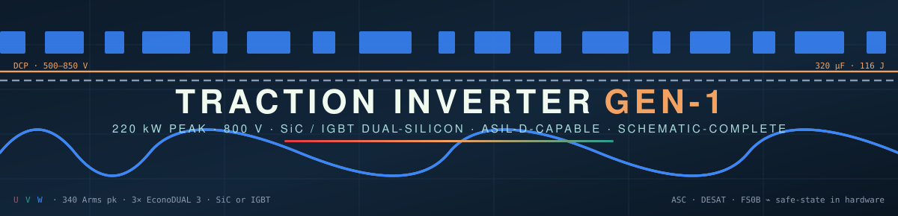
</p>

<p align="center">
  
  
  
  
</p>
<p align="center">
  
  
  
  
  
  
  
  
  
  
</p>

<h3 align="center">
  A 220 kW-class, 800 V SiC traction inverter for passenger-EV / commercial drives —<br/>
  engineered to be <b>economical</b>, <b>ASIL-D-capable</b>, and <b>buildable by any competent CEM</b>.
</h3>

<p align="center">
  <a href="#-schematics">Schematics</a> ·
  <a href="#-specifications">Specs</a> ·
  <a href="#%EF%B8%8F-system-architecture">Architecture</a> ·
  <a href="#-functional-safety-asil-d-concept">Safety</a> ·
  <a href="#-dc-link-discharge--checked">Discharge</a> ·
  <a href="#-bom--cost-analysis">BOM & Cost</a> ·
  <a href="#-manufacturing--sourcing">Manufacturing</a> ·
  <a href="#-verification-pipeline">Verification</a> ·
  <a href="#-getting-started">Build</a> ·
  <a href="#-roadmap">Roadmap</a>
</p>

---

## 🎯 What this is

**GEN-1** is a complete, netlist-verified schematic set + costed BOM for a two-board traction
inverter, generated from a single **tscircuit** source of truth:

| Board | Domain | Contents | Parts |
|---|---|---|---|
| 🔴 **Power board** | HV (500–850 V) | 3× HIITIO `HCS600FH120D3C1` SiC half-bridges (EconoDUAL™ 3), 320 µF film DC-link, active + passive discharge, 6× isolated gate-drive channels, dual gate-power flybacks, 2× isolated V<sub>DC</sub> senses, ASC buffer, HVIL loop | **309** |
| 🔵 **Control card** | LV (KL30) | NXP **S32K396** lockstep MCU + **FS2633D** ASIL-D SBC, hardware gate-enable chain, ASC latch, resolver AFE, 3× hall-current AFE, 2× CAN-FD, vehicle interface | **217** |

Both boards talk over one 40-way harness that is **default-OFF on every line it can float**.
The design leans on three production references, read line-by-line: NXP **EV-INVERTERGEN3**
(control architecture, adopted almost verbatim), Wolfspeed **CRD300DA12E-XM3** (discharge +
gate-drive practice), and TI **TIDM-02014** (safety decomposition patterns).

> [!IMPORTANT]
> **Supply position:** the four power-silicon pieces (3 modules + discharge FET) come through
> a **direct HIITIO relationship**. Everything else on the BOM is LCSC-stocked or one
> ships-today DigiKey basket — verified line-by-line in two live sourcing sweeps.

---

## 📐 Schematics

The complete drawing set, one sheet per board — dashed functional sections, net-label-only
cross-section wiring, sheet index + net-naming + safety panels, self-identifying title blocks.

**➡️ Open the PDF set: [`boards/out-pdf/`](boards/out-pdf/) · Import into EasyEDA Pro / KiCad 5: [`kicad5/Traction-Inverter-SHIP.zip`](kicad5/Traction-Inverter-SHIP.zip)**

| Sheet 1 — Power board (HV) | Sheet 2 — Control card (LV) |
|---|---|
| [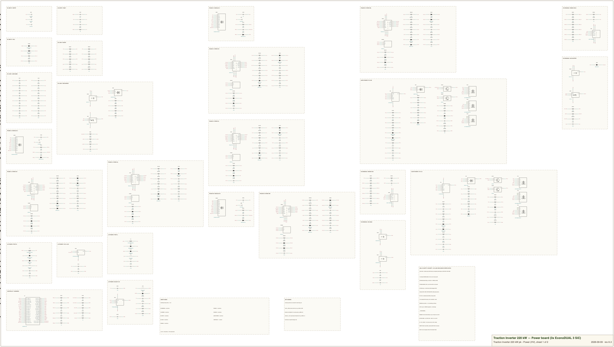](boards/out-pdf/) | [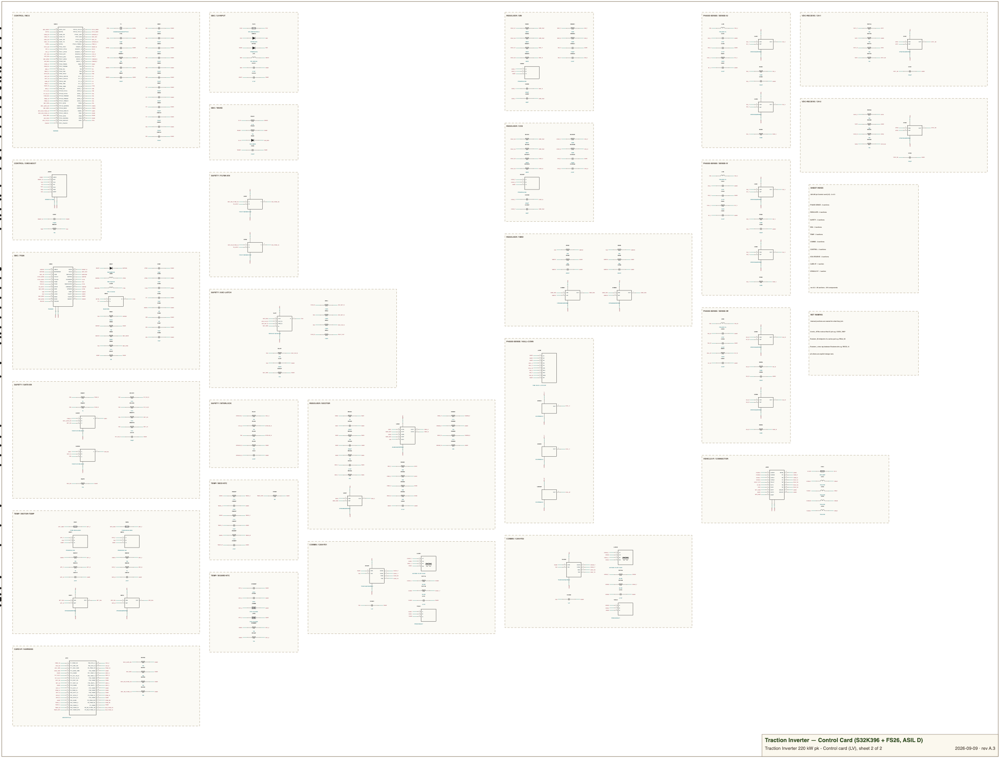](boards/out-pdf/) |

Every sheet carries its own review panels — the ASIL-D concept and the discharge verification
are printed **on the drawing**, so the schematic is never the only artifact a reviewer holds:

<p align="center">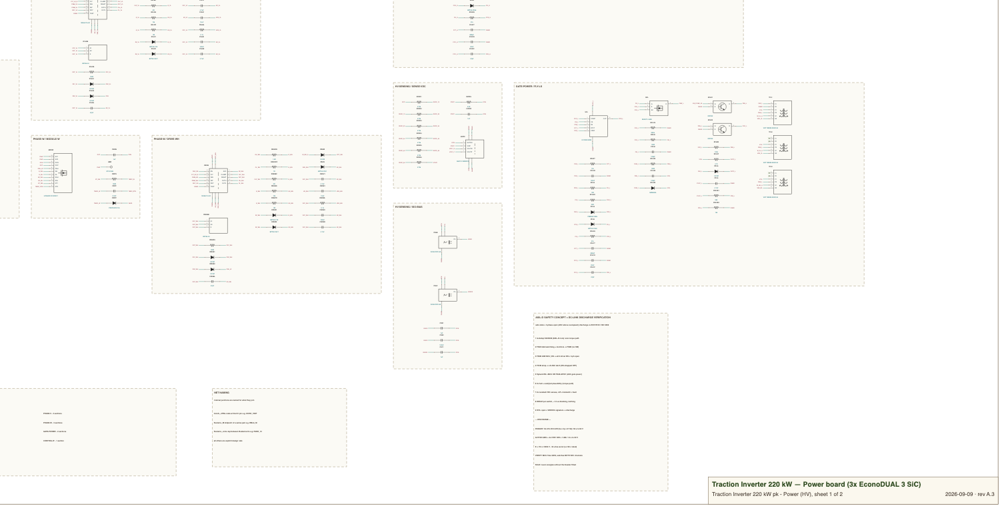</p>

---

## ⚡ Specifications

<table>
<tr><td valign="top" width="50%">

### Ratings

| Parameter | Value |
|---|---|
| DC-link voltage | **500 – 850 V** (700 V nom) |
| Peak power | **220 kW** / 30 s |
| Continuous power | **120 kW** |
| Peak phase current | **340 A<sub>rms</sub>** (480 A pk) |
| Continuous phase current | 185 A<sub>rms</sub> |
| DC feed current | 314 A pk / 171 A cont |
| Switching frequency | 8 – 10 kHz SVPWM |
| Motor type | 3-φ PMSM, resolver feedback |
| Cooling | Liquid coldplate @ 65 °C |
| Ambient | −40 … +85 °C |

</td><td valign="top" width="50%">

### Key silicon

| Function | Part | Grade |
|---|---|---|
| Power switch ×3 | HIITIO **HCS600FH120D3C1** 1200 V/600 A | EconoDUAL 3 |
| Gate driver ×6 | **NSI6611A-Q1** 10 A iso, DESAT + Miller | AEC-Q100 |
| MCU | NXP **S32K396** lockstep M7 | ASIL-D |
| Safety SBC | NXP **FS2633D** | ASIL-D |
| V<sub>DC</sub> sense ×2 | **AMC1311B** reinforced iso | — |
| Phase current ×3 | LEM **HC5FW 900-S** hall | 900 A |
| Resolver driver | **ALM2402Q-Q1** | AEC-Q100 |
| CAN-FD ×2 | **TCAN1042HGV-Q1** | AEC-Q100 |

</td></tr>
</table>

<details>
<summary><b>📏 Sizing math (click to expand)</b> — why every number above closes</summary>

| Check | Calculation | Result |
|---|---|---|
| Max line-line voltage | V<sub>ll</sub> = V<sub>dc</sub>/√2 = 700/1.414 | 495 V<sub>rms</sub> |
| Power available | √3 · 495 · 340 · 0.85 | 248 kW ≥ 220 kW ✅ |
| Per-switch conduction (peak) | I<sub>rms</sub> ≈ 240 A vs 600 A rating · ~3 mΩ hot | ≈ 175 W |
| Per-switch switching @700 V/10 kHz | scaled from module E<sub>on</sub>+E<sub>off</sub> | ≈ 80 W |
| Per-switch total | 30 s peak / continuous | ≈ 255 W / ≈ 95 W ✅ |
| Voltage utilization | 850 V / 1200 V | 71 % (XM3/TIDM practice) ✅ |
| DC-link ripple current | I<sub>c,rms</sub> ≈ 0.62 · I<sub>ph</sub> | 211 A pk / 115 A cont |
| Link capability | 16 cans × ≥13 A each | ≥ 208 A ✅ |
| Stored energy @850 V | ½ · 320 µF · 850² | **116 J** |
| Gate power per switch | Q<sub>g</sub>·ΔV·f ≈ 3 µC·19 V·10 kHz | 0.6 W ✅ |
| Hall range | ±900 A vs 480 A pk | 1.9× headroom ✅ |

Full derivations: [`docs/design-basis.md`](docs/design-basis.md)

</details>

---

## 🏗️ System architecture


<details>
<summary><b>🔌 One gate-drive channel in depth</b> (×6 on the board)</summary>

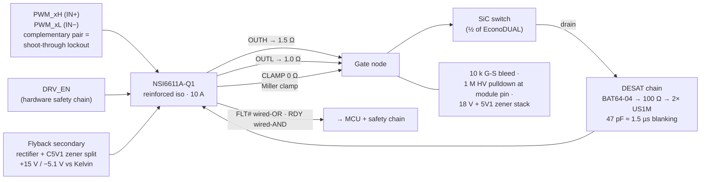

Values carried from the GEN3/XM3 references; `R_g` tuned at double-pulse test.

</details>

---

## 🛡 Functional safety (ASIL-D concept)

The safe state is **3-phase-open**; above the overspeed threshold it is **ASC**
(active short via the low side). Every path below exists **in hardware** — no software in the loop.

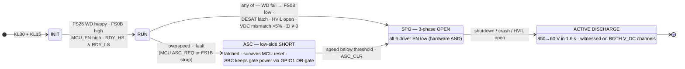

<details>
<summary><b>🔟 The ten hardware mechanisms (decomposition table)</b></summary>

| # | Mechanism | Independence argument |
|---|---|---|
| 1 | Lockstep **S32K396** (ASIL-D core) runs the torque path | — |
| 2 | **FS26 Q&A watchdog** + rail monitors → **FS0B** | Separate silicon, zero software |
| 3 | FS0B ∧ MCU_EN ∧ RDY **hardware AND** → all 6 driver enables | Discrete 74LVC1G11-Q100 gates |
| 4 | **FS1B strap → latched LS-ASC select** (HS strapped OFF) | SBC-commanded, survives MCU reset |
| 5 | Flyback enables **OR-gated (MCU ∨ FS26-GPIO1)** | SBC alone keeps gate power for ASC |
| 6 | 3× hall current + **ΣI = 0 plausibility** | 3rd channel = built-in redundancy |
| 7 | **2× independent isolated V<sub>DC</sub>** senses, >5 % ⇒ fault | Separate dividers + bias |
| 8 | Per-switch **DESAT** (~1.5 µs blanking, latching) | Different technology vs halls |
| 9 | **HVIL** ladder — open = V<sub>DDIO</sub>/2 signature → discharge | Continuous hardware monitor |
| 10 | **Default-OFF pulldowns** on every harness-floatable line | Passive |

> The architecture implements the NXP GEN3 / TI TIDM-02014 pattern. A formal ASIL-D *claim*
> additionally needs the ISO 26262 work products (HARA, FMEDA, DFA) — out of schematic scope;
> the hardware those analyses lean on is all present. In parts, the entire safety chain costs **₹37**.

</details>

---

## 🔻 DC-link discharge — checked

Both references ship only a passive bleeder; GEN-1 keeps that network **and** adds a
default-OFF active path for the ≤2 s crash case — then *verifies* it.

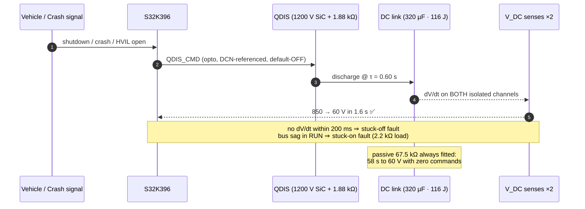

| Path | Network | τ | 850 → 60 V | Stress per resistor |
|---|---|---|---|---|
| **Passive** (always on) | 10× 27 kΩ 2512 2 W, 5s×2p = 67.5 kΩ | 21.6 s | **57 s** ✅ (<60 s, XM3 parity) | 1.07 W (54 %) · 170 V (85 % of 200 V) |
| **Active** (commanded) | 4× 470 Ω 10 W wirewound + SiC FET = 1.88 kΩ | 0.60 s | **1.6 s nom / 1.84 s worst** ✅ (≤2 s crash at tolerance corners · 5 s R100 ×2.7) | 32 J worst pulse (≥100 J rated) · 213 V |

> [!WARNING]
> **Rule printed on sheet 1:** never energize without the passive bleeder network fitted.

---

## 📊 BOM & cost analysis

**Electronics BOM: ₹69,809 @1k volume** · 529 components · 164 lines · zero unmatched.
Machine-generated from the netlists — the sheets, BOM and LCSC fields resolve through one
parts-db, so they cannot disagree. Full data: [`docs/bom.md`](docs/bom.md) ·
[`bom-power.csv`](docs/bom-power.csv) · [`bom-control-card.csv`](docs/bom-control-card.csv)

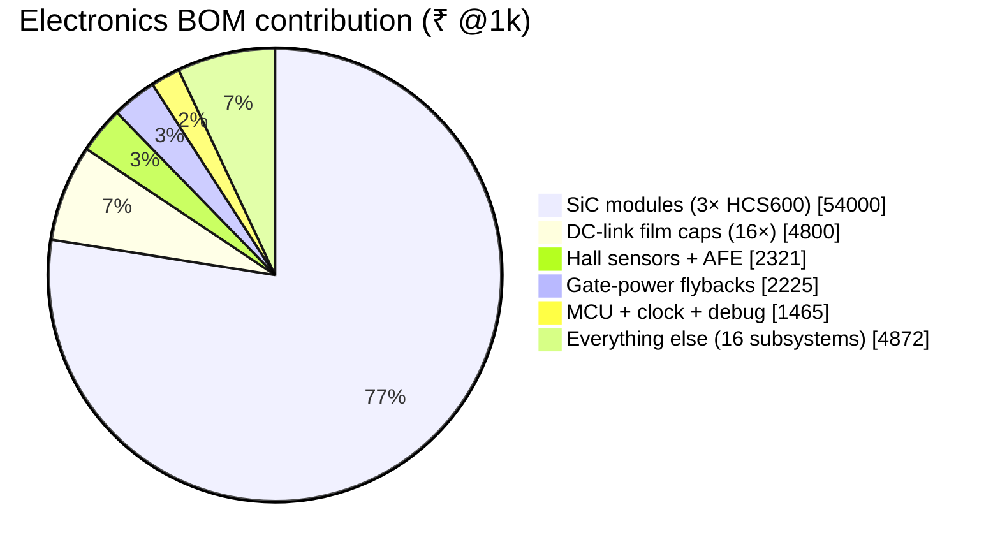

**The Pareto is extreme by design:** 19 components carry 84 % of the cost — concentrated in
*quotable, second-sourced* lines — while the ~470-part long tail is LCSC-basic jellybeans.
The complete 6-channel isolated gate drive is ₹656; the whole ASIL-D safety chain is ₹37.

<details>
<summary><b>📈 Full subsystem Pareto (21 rows)</b></summary>

| Subsystem | ₹ @1k | Share | Cumulative | Parts |
|---|---|---|---|---|
| SiC power modules | 54,000 | 77.5 % | 77.5 % | 3 |
| DC-link film caps | 4,800 | 6.9 % | 84.4 % | 16 |
| Hall sensors + AFE | 2,321 | 3.3 % | 87.7 % | 34 |
| Gate-power flybacks | 2,225 | 3.2 % | 90.9 % | 63 |
| MCU + clock + debug | 1,465 | 2.1 % | 93.0 % | 22 |
| Vehicle connector + protection | 785 | 1.1 % | 94.1 % | 6 |
| Gate drivers + networks | 656 | 0.9 % | 95.1 % | 120 |
| Discharge (active + passive) | 630 | 0.9 % | 96.0 % | 21 |
| Module snubbers | 540 | 0.8 % | 96.8 % | 3 |
| FS26 SBC + LV input + wake | 527 | 0.8 % | 97.5 % | 27 |
| V<sub>DC</sub> iso sensing + bias | 340 | 0.5 % | 98.0 % | 21 |
| Resolver AFE | 269 | 0.4 % | 98.4 % | 48 |
| Harness + pulldowns | 246 | 0.4 % | 98.7 % | 17 |
| LV power (prot + LDO + boost) | 236 | 0.3 % | 99.1 % | 24 |
| HV entry / Y-caps / HVIL / studs | 188 | 0.3 % | 99.3 % | 14 |
| ASC buffer | 139 | 0.2 % | 99.5 % | 7 |
| CAN-FD ×2 | 132 | 0.2 % | 99.7 % | 14 |
| Temps (module/board/motor) | 82 | 0.1 % | 99.9 % | 24 |
| V<sub>DC</sub> receivers (card) | 61 | 0.1 % | 99.9 % | 12 |
| Safety chain (EN/ASC/ILK) | 37 | 0.1 % | 100.0 % | 21 |
| Module NTC routing | 4 | 0.0 % | 100.0 % | 9 |

</details>

### 💰 Full unit cost @1,000 units

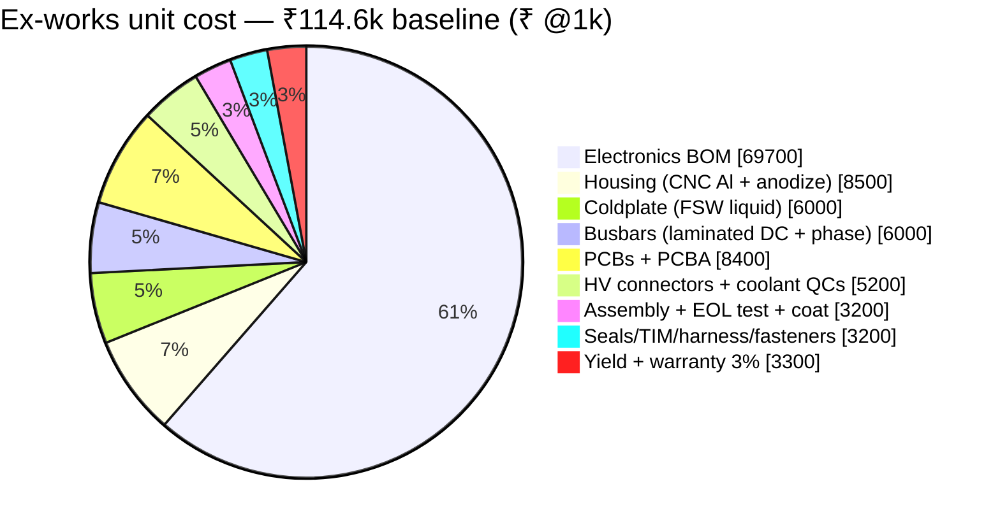

| | Low | **Baseline** | High |
|---|---|---|---|
| Ex-works cost / unit | ₹99.9k | **₹114.6k (~$1,380)** | ₹150.9k |
| ₹/kW | 454 | **521 ($6.3/kW)** | 686 |
| 1,000-unit build | ₹10.0 Cr | **₹11.5 Cr** | ₹15.1 Cr |
| Suggested ex-works price (35–40 % GM) | | **₹1.75–1.95 L (~$2,200)** | |

The two lines that move everything: the **HIITIO module quote** (47 % of unit cost) and the
**film-cap quote**. Comparable imported units (Cascadia CM350 class) sell at $4,000–7,000.
Detail + NRE table: [`docs/cost-rollup.md`](docs/cost-rollup.md)

---

## 🏭 Manufacturing & sourcing

Rev A.2 was a dedicated DFM pass, driven by **two live sourcing sweeps** (every specific MPN
checked on LCSC; misses re-checked on DigiKey/Mouser with LCSC alternates). Result — five
sourcing tiers, nothing single-channel outside the anchors:

| Tier | What | Lines | Channel |
|---|---|---|---|
| 🤝 **T1 Direct** | 3× SiC module + discharge FET | 4 | HIITIO (relationship in place) |
| 🏛 **T2 Franchise** | S32K396 · FS2633D · 3× LEM hall | 5 | NXP/LEM — **order first, longest lead** |
| 📦 **T3 DigiKey ships-today** | VGT12EEM-200S1A4 ×6 · AMPSEAL · 10 W wirewounds · BAT64-04… | ~16 | one consolidated order |
| ✅ **T4 LCSC-verified** | ~60 lines *with live C-numbers* — incl. automotive grades of NSI6611A-Q1, AMC1311B, ALM2402Q-Q1, TCAN1042-Q1, TPS55340-Q1, OPA348-Q1, 74LVC1G11-Q100H, Faratronic link caps | ~60 | LCSC / JLC |
| 🧂 **T5 Jellybeans** | 0603+ passives, zeners, SS34, 2N7002… | ~440 | LCSC basic |

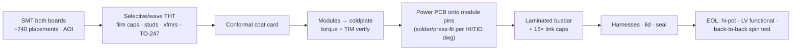

<details>
<summary><b>🔧 The six DFM design changes in rev A.2</b></summary>

| # | Change | Why | Effect |
|---|---|---|---|
| 1 | Flyback controller **NJW4140 → UCC28C43** + 2-transistor default-OFF enable clamp | Nisshinbo part had 0–2 pcs on LCSC; UCC28C4x is TI+ST multi-source everywhere | Also **caught a latent bug**: the aux-only VCC could never start — trickle-start added |
| 2 | DC link **8× 40 µF → 16× Faratronic 20 µF/1100 V** (C2840809) | No 40 µF/1100 V can exists on LCSC in any brand | **−₹2.8k**, better ripple spread; TDK B32778 stays drop-in alt |
| 3 | Bleeder **9× TE CRGP (500 V specialty) → 10× generic 27 k 2512 2 W** 5s×2p | TE part is TTI-only in volume | 170 V/resistor inside standard ratings — any vendor builds it |
| 4 | Resolver driver **confirmed ALM2402Q-Q1** (LCSC C544754) | Sweep found the GEN3-exact part in stock | No redesign |
| 5 | **Value consolidation** 4.99k→5.1k · 49.9k→51k · 12.1k→12k · 0402→0603 | Fewer feeders, JLC-basic, easier rework | Firmware-calibrated scalings unaffected |
| 6 | Vehicle connector → concrete **TE AMPSEAL 23-pos** (776231-1 + 770680-1) | Was an abstract class | DigiKey ~$9, sealed automotive |

Full plan incl. layout-phase DFM rules and proto-vs-production grade policy: [`docs/dfm.md`](docs/dfm.md)

</details>

---

## 🔬 Verification pipeline

Everything on this repo is **generated and gated** — the drawing set ships only at 100 %.


Three independent verification layers — each with its own tool, none trusting the others:

| Layer | Tool | What it proves | Result |
|---|---|---|---|
| Sheets ⇄ netlist (geometry) | `kicad5-verify.mjs` | every drawn pin lands on its intended net | **1540/1540 · 100 %** |
| Netlist ⇄ intent (structure) | `erc-audit.mjs` | pairing, chain topology, polarity, rails, floats | **664 checks · 0 fail** |
| Numbers ⇄ physics (worst case) | `design-verify.mjs` | losses, thermal, discharge corners, protection, tolerances | **51 PASS · 3 WARN · 0 FAIL** (all constants datasheet-real) |

The rev A.3 verification campaign found and fixed **18 real defects** (F1–F36 log) — among them a gate
supply that could never start (FB divider scaled for the wrong controller reference), a
current-sense resistor whose "limit" was 30 A, five floating-pin net aliases, load-dump-underrated
input caps, a discharge string that missed the crash target at tolerance corners, and an
ASC drive that violated the driver's GND2+6 V absolute maximum (caught by reading the real
NSI6611 datasheet — clamped at 5.1 V now).
Full findings log + margin tables: [`docs/verification-report.md`](docs/verification-report.md).

| Metric | Power | Card | Total |
|---|---|---|---|
| Components | 312 | 217 | **529** |
| Functional sections | 26 | 26 | 52 |
| Net labels / pin stubs | 843 | 697 | 1,540 |
| Sheet size | 36.6″ × 30.3″ | 40.6″ × 30.1″ | 2 sheets |

---

## 🚀 Getting started

```bash
npm install
```

```bash
npm run build     # tscircuit netlists  → dist/boards/*/circuit.json
```

```bash
npm run sheets    # pages → KiCad5 sheets → 100% pin-verify → SVG → PDFs  (needs Chrome)
```

```bash
npm run bom       # docs/bom.md + per-board CSVs
```

### 📁 Repository map

| Path | What lives there |
|---|---|
| [`boards/power.tsx`](boards/power.tsx) · [`boards/control-card.tsx`](boards/control-card.tsx) | **Source of truth** — the two board netlists |
| [`packages/cells.tsx`](packages/cells.tsx) | Parameterized cells: gate-drive channel, flyback chain, iso V-sense, hall AFE, CAN, 40-way harness map |
| [`calculations/parts-db.mjs`](calculations/parts-db.mjs) | Designator→MPN/LCSC/price/alt database + on-sheet safety/discharge panel text |
| [`calculations/*.mjs`](calculations/) | The generator pipeline (pages · kicad5-gen · verify · print · pdf · bom) |
| [`boards/out-pdf/`](boards/out-pdf/) | 📄 Rendered PDF schematic set |
| [`kicad5/`](kicad5/) | EasyEDA-Pro/KiCad-5 importable sheets + `Traction-Inverter-SHIP.zip` |
| [`docs/design-basis.md`](docs/design-basis.md) | Ratings, sizing math, safety concept, references |
| [`docs/dfm.md`](docs/dfm.md) | Manufacturability plan + sourcing tiers |
| [`docs/bom.md`](docs/bom.md) | Generated BOM with subsystem Pareto |
| [`docs/cost-rollup.md`](docs/cost-rollup.md) | Full unit cost + NRE + pricing guidance |
| [`docs/verification-report.md`](docs/verification-report.md) | **End-to-end verification**: findings log F1–F30, margin tables, worst-case corners |
| [`docs/datasheets/`](docs/datasheets/) | Component datasheet pack (30+ PDFs) + extracted parameters |

---

## 🗺 Roadmap

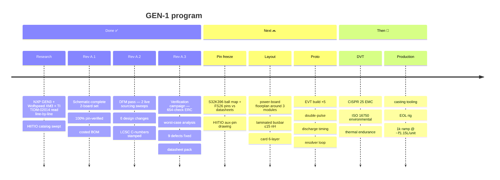

> [!NOTE]
> **⚠️ VERIFY-before-layout list** — after the A.3 datasheet round, the open items are:
> ① S32K396 ball map & FS2633D package pins are symbolic (names are the real GEN3 nets;
> numbers need the datasheet pass) · ② ASC hold during VCC2-UVLO + flyback core saturation at the 3 A limit (bench items) ·
> ③ FS26 OTP configuration (VMON windows, VCORE=1.5 V) · ④ LEM lead time — **order T2 parts at
> kickoff**. *Closed by reading the real datasheets: HCS600 aux-pin map, NSI6611 pin map/UVLO/RDY/ASC,
> VGT12EEM winding (1:1.6:2.9, Lp 10 µH — flyback fully re-derived), UCC28C40 UVLO grade,
> FS26 VMONEXT/FS0B drive, S32K39 core-ballast topology, C3D ripple rating.*

---

## 📚 References

| Source | What GEN-1 took from it |
|---|---|
| **NXP EV-INVERTERGEN3** (SPF-91122 / EV-POWEREVBHD2) | Control architecture near-verbatim: FS26 rails & FS0B/FS1B paths, OR-gated flyback enables, resolver AFE chain, hall AFE, PWM/PWMALT lockout, interlock signature |
| **Wolfspeed CRD300DA12E-XM3** (PRD-06975 + discharge PCB) | Passive-bleeder discharge numbers, gate-drive practice (±15/−4 rails, soft-shutdown, 2 µs dead-time guidance), DC-link class |
| **TI TIDM-02014** (TIDUF23A) | Safety decomposition: PMIC SAFE-OUT OR-gate, LVSS strap matrix concept, dual-path ASC authority |
| **HIITIO catalog** (hiitio.com, 2025 datasheets) | HCS600FH120D3C1 module line, HCM75S12T4K3; EconoDUAL 3 footprint strategy |

---

<p align="center">
  
  <br/>
  <sub><b>Traction Inverter GEN-1</b> · rev A.2 · 2026-09-09 · schematic-complete, layout next.<br/>
  Proprietary — © Vectivolt. Reference designs cited remain property of their respective owners.</sub>
</p>
