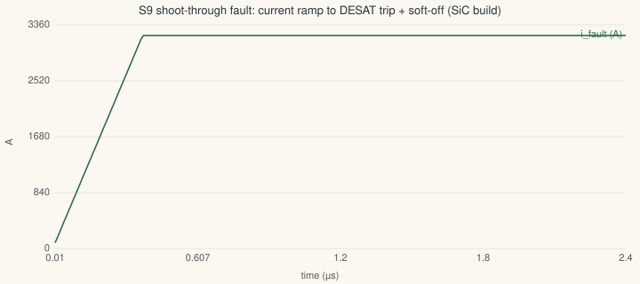

# Simulation report (rev A.5 · generated 2026-09-09)

Numerical time/frequency-domain simulations of the drawn circuits at the actual operating
conditions (`calculations/sim-verify.mjs`). These complement — not replace — the closed-form
worst-case rows in `docs/verification-report.md`. Items that require hardware (layout
parasitics, transformer saturation, SiC short-circuit withstand, EMI) remain bench gates and
are flagged in each row's note.

| # | Simulation | Result | Limit / target | Status | Note |
|---|---|---|---|---|---|
| S1 | Flyback steady rail @9 V in | 21.3 V (target 21.4) | ±5 % | ✅ PASS | settles in 4 ms · steady Ipk 1.82 A vs 3.03 A limit |
| S1 | Flyback drain peak @9 V in | 36.1 V | 80 V BUK7Y14-80E | ✅ PASS | leakage 2 % assumed — bench-confirm the ring; clamp path bounds it |
| S1 | Flyback steady rail @12 V in | 21.3 V (target 21.4) | ±5 % | ✅ PASS | settles in 4 ms · steady Ipk 1.82 A vs 3.03 A limit |
| S1 | Flyback drain peak @12 V in | 39.1 V | 80 V BUK7Y14-80E | ✅ PASS | leakage 2 % assumed — bench-confirm the ring; clamp path bounds it |
| S1 | Flyback steady rail @16 V in | 21.3 V (target 21.4) | ±5 % | ✅ PASS | settles in 4 ms · steady Ipk 1.82 A vs 3.03 A limit |
| S1 | Flyback drain peak @16 V in | 43.1 V | 80 V BUK7Y14-80E | ✅ PASS | leakage 2 % assumed — bench-confirm the ring; clamp path bounds it |
| S1 | Flyback bank load, IGBT variant @6 kHz | 1.63 W demand | 2.88 W DCM capacity | ✅ PASS | Qg 4.36 µC scaled to the 20.7 V swing; same rails, same transformer |
| S2 | UB15 crossover @12 V in | 2.45 kHz | «fsw/10 (58 kHz) · «RHPZ (451 kHz) | ✅ PASS |  |
| S2 | UB15 phase margin @12 V in | 75° | ≥45° | ✅ PASS | vs ~0° for the pre-A.4.3 capacitor-only COMP; measured Bode still a bench gate |
| S2 | UB15 crossover @9 V in | 1.91 kHz | «fsw/10 (58 kHz) · «RHPZ (254 kHz) | ✅ PASS |  |
| S2 | UB15 phase margin @9 V in | 72° | ≥45° | ✅ PASS | vs ~0° for the pre-A.4.3 capacitor-only COMP; measured Bode still a bench gate |
| S3 | Cap ripple per can, peak-30s (340 A) | 11.9 A rms (bank 191 A) | 15.4 A/can @10 kHz/70 °C | ✅ PASS | switching-state simulation; IGBT variant at 4–6 kHz has the same rms (frequency shifts, magnitude does not) |
| S3 | Cap ripple per can, continuous (216 A) | 7.6 A rms (bank 121 A) | 15.4 A/can @10 kHz/70 °C | ✅ PASS | switching-state simulation; IGBT variant at 4–6 kHz has the same rms (frequency shifts, magnitude does not) |
| S4 | Tj end of 30 s / 220 kW peak — SiC (8 kHz) | 89 °C | 150 °C ceiling (175 abs) | ✅ PASS | coldplate 0.045 K/W per switch is an assumption — thermal test closes it |
| S4 | Tj end of 30 s / 220 kW peak — IGBT variant (6 kHz) | 110 °C | 150 °C ceiling (Tvjop) | ✅ PASS | coldplate 0.045 K/W per switch is an assumption — thermal test closes it |
| S5 | Active discharge to 60 V, nominal | 1.53 s | ≤2 s crash target (5 s R100) | ✅ PASS | peak 99 W and 28.3 J per 470 Ω (100 J single-pulse class) |
| S5 | Active discharge to 60 V, worst (+10 %C, +5 %R) | 1.76 s | ≤2 s crash target (5 s R100) | ✅ PASS | peak 94 W and 31.1 J per 470 Ω (100 J single-pulse class) |
| S6 | Current-loop PM @1 kHz crossover | 58° | ≥45° (≥40 accepted) | ✅ PASS | double-update FOC (75 µs delay); motor 0.35 mH/25 mΩ assumed — bind at commissioning |
| S6 | Current-loop PM @1.5 kHz crossover | 42° | ≥45° (≥40 accepted) | ⚠️ WARN | double-update FOC (75 µs delay); motor 0.35 mH/25 mΩ assumed — bind at commissioning |
| S6 | Max crossover for 45° margin | 1.39 kHz | design statement: loop BW ≤1.2 kHz | ✅ PASS | sets the firmware bandwidth ceiling with the drawn filters |
| S7 | Gate peak current (on/off) | 8.6 / 14.3 A | 10 A driver class | ✅ PASS | off-path exceeds 10 A only into the nominal short — real Ipk source-limited by the driver |
| S7 | Effective switching time (Qg model) | 240 / 145 ns | - | ℹ️ | double-pulse remains the bench gate for dv/dt, overshoot and Rg trim |
| S8 | Loop-L budget for Vds ≤ 90 % (1080 V) | 18 nH | busbar target ≤15 nH (design basis) | ✅ PASS | at the fast 20 kA/µs corner; slower Rg trim relaxes it |
| S8 | Breaking point (Vds = 1200 V abs) | 42 nH | - | ℹ️ | the laminated-busbar spec line exists to stay 2× under this; double-pulse closes the real number |
| S9 | Fault cleared, SiC build | 2.4 µs · E ≈ 5.6 J | 3 µs-class withstand | ✅ PASS | SiC tSC unpublished — 3 µs class assumed, vendor letter is the gate |
| S9 | Fault cleared, IGBT variant | 4.3 µs · E ≈ 6.3 J | 10 µs-class withstand | ✅ PASS | Isc 1800 A per DS; 10 µs class |
| S10 | ASC hold-up after TOTAL LV loss | 15 ms (VCC2 15.6→10.4 V) | - | ⚠️ WARN | operating limit: sustained ASC REQUIRES KL30 present (FS26 GPIO1 holds the flybacks). Vehicle-level: ASC is not credited through a dead 12 V system — stated in the safety concept |

**23 PASS · 2 WARN · 0 FAIL**

## Modeling assumptions (each is a named bench-closure item)
- S1: transformer leakage 2 % of Lp; converter losses lumped at 8 %; P-control stands in for the UCC28C40 error amp.
- S2: current-mode small-signal per TI SLVSBD4E; internal current-sense gain estimated; slope compensation not modeled.
- S4: coldplate 0.045 K/W per switch to 65 °C coolant; single-τ nodes (no vendor Zth curve published).
- S5: 2.5 ms bias-startup dead time before the active path conducts.
- S6: motor 0.35 mH / 25 mΩ assumed; PI tuned by the L·ωc rule.
- S8: 20 kA/µs fast-corner di/dt, module Coss 5 nF class, first-overshoot ring fraction 0.25.
- S9: 100 nH shoot-through stray, desat saturation clamp at the device limit, 1 µs soft-off.
- S10: 5 mA static driver load per channel; gates not switching during the hold.

## What simulation cannot close (bench/vendor gates — the numbers above bound them)
S8 gives the loop-inductance BUDGET; the real busbar L and waveform come from double-pulse.
S9 gives the reaction TIMELINE; SiC withstand needs the vendor letter (tSC unpublished).
S10 gives the hold WINDOW; the FS26-orchestrated entry/exit sequence is a bench script.
Still hardware-only: transformer core saturation at the CS limit, EMI/CISPR, measured
regulator Bode/load steps, FS26 VCORE loop (internally compensated — parts per Table 106).
