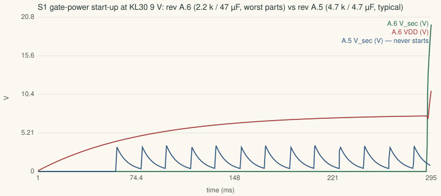
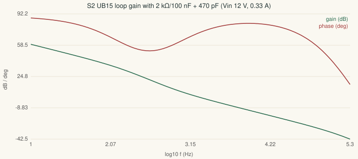
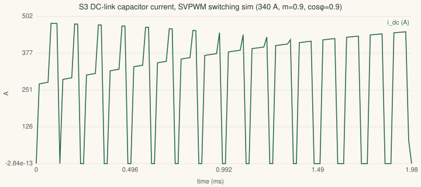
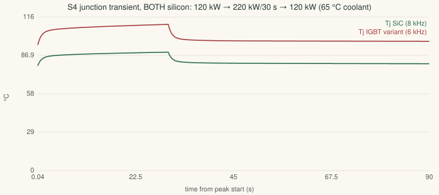
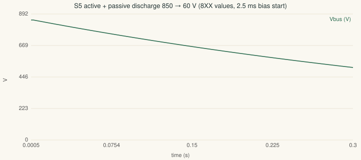
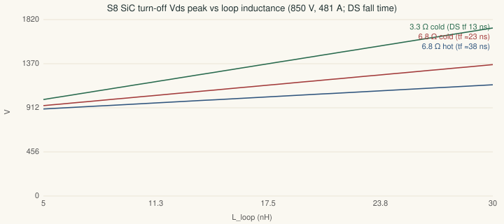
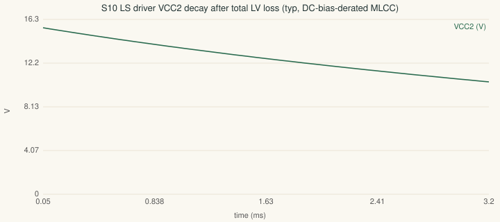

# Simulation report (rev A.7 · generated 2026-09-23)

Numerical time/frequency-domain simulations of the drawn circuits at the actual operating
conditions (`calculations/sim-verify.mjs`). These complement — not replace — the closed-form
worst-case rows in `docs/verification-report.md`. Items that require hardware (layout
parasitics, transformer saturation, SiC short-circuit withstand, EMI) remain bench gates and
are flagged in each row's note.

| # | Simulation | Result | Limit / target | Status | Note |
|---|---|---|---|---|---|
| S1 | Flyback drain peak @9 V in | 36.2 V | 80 V BUK7Y14-80E | ✅ PASS | leakage 2 % assumed — bench-confirm the ring; SMAJ13A clamp path bounds it |
| S1 | Flyback drain peak @16 V in | 43.2 V | 80 V BUK7Y14-80E | ✅ PASS | leakage 2 % assumed — bench-confirm the ring; SMAJ13A clamp path bounds it |
| S1 | Flyback DCM throughput per bank (regulation) | 2.89 W at 90 % of the CS limit | Vin-independent 6–16 V | ✅ PASS | t_on + t_reset < T above ≈6 V, so the rail regulates at any KL30 once running — startup is the separate question below |
| S1 | Gate-power STARTUP, A.5 as drawn: 4.7 k / 4.7 µF | KL30 9 V: typ NO START (secondaries peak 3.5 V) · worst NO START (secondaries peak 0 V) · KL30 14 V worst NO START (secondaries peak 1.8 V) | one-burst start at every corner, KL30 9–16 V | ℹ️ | historical — the rev A.5 values could never start at 9 V (review F18 was right, and it was worse than 'marginal') |
| S1 | Gate-power STARTUP, A.7: 2.2 k / 47 µF (≈37 µF eff), FB on the FFS node | KL30 9 V: typ 176 ms (1 burst) · worst 240 ms (1 burst) · KL30 14 V worst 73 ms (1 burst) | one-burst start at every corner, KL30 9–16 V | ✅ PASS | worst = UVLO 7.5/7.1 V, 3.5 mA IC, 45 nC FET, CS 0.9 V, Lp −20 %, 3 mA driver current; 22 µF (18 µF eff) still fails this corner |
| S1 | Flyback bank load, SiC @10 kHz (1.09 µC) | 1.32 W demand | 2.31 W at worst parts (CS 0.9 V, Lp −20 %, 100 % limit) | ✅ PASS | same rails, same transformer for every SKU |
| S1 | Flyback bank load, IGBT @5 kHz (4.36 µC, unscaled, RT 8.2 k) | 1.99 W demand | 2.81 W at worst parts (CS 0.9 V, Lp −20 %, 100 % limit) | ✅ PASS | same rails, same transformer for every SKU |
| S2 | UB15 crossover @12 V in | 2.45 kHz | «fsw/10 (58 kHz) · «RHPZ (451 kHz) | ✅ PASS |  |
| S2 | UB15 phase margin @12 V in | 75° | ≥45° | ✅ PASS | vs ~0° for the pre-A.4.3 capacitor-only COMP; measured Bode still a bench gate |
| S2 | UB15 crossover @9 V in | 1.91 kHz | «fsw/10 (58 kHz) · «RHPZ (254 kHz) | ✅ PASS |  |
| S2 | UB15 phase margin @9 V in | 72° | ≥45° | ✅ PASS | vs ~0° for the pre-A.4.3 capacitor-only COMP; measured Bode still a bench gate |
| S3 | Cap ripple per can, worst point — 8XX bank, 340 A | 13.8 A rms (bank 221 A, M 0.6, cosφ 1) | 15.4 A/can @10 kHz/70 °C | ✅ PASS | rated point (M 1.0, cosφ 0.85) 10.9 A/can; equal sharing assumed — 15–20 % busbar imbalance is a thermal-test item |
| S3 | Cap ripple per can, worst point — 4XX bank, 400 A | 16.2 A rms (bank 260 A, M 0.6, cosφ 1) | 18 A/can @10 kHz/70 °C | ✅ PASS | rated point (M 1.0, cosφ 0.85) 12.8 A/can; equal sharing assumed — 15–20 % busbar imbalance is a thermal-test item |
| S4 | Tj end of 30 s peak — 8XX SiC (340 A, 850 V, 10 kHz) | 122 °C (from 90 °C continuous) | 175 °C Tj max | ✅ PASS | 554 W/switch peak, 200 W continuous (hottest die); coldplate 0.045 K/W assumed |
| S4 | Tj end of 30 s peak — 8XX IGBT (340 A, 850 V, 5 kHz) | 129 °C (from 99 °C continuous) | 150 °C Tvjop | ✅ PASS | 560 W/switch peak, 250 W continuous (hottest die) + diode 91/42 W into the shared coldplate (RR07); coldplate 0.045 K/W assumed |
| S4 | Tj end of 30 s peak — 4XX IGBT (400 A, 500 V, 5 kHz) | 123 °C (from 100 °C continuous) | 150 °C Tvjop | ✅ PASS | 496 W/switch peak, 253 W continuous (hottest die) + diode 82/43 W into the shared coldplate (RR07); coldplate 0.045 K/W assumed |
| S4 | Tj end of 30 s peak — 4XX SiC (400 A, 500 V, 10 kHz) | 130 °C (from 98 °C continuous) | 175 °C Tj max | ✅ PASS | 618 W/switch peak, 261 W continuous (hottest die); coldplate 0.045 K/W assumed |
| S5 | Active discharge 850→60 V, 8XX, nominal | 1.57 s | ≤2 s crash target (5 s R100) | ✅ PASS | 28.2 J per 470 Ω wirewound (100 J single-pulse class); bleeder 66 k counted once |
| S5 | Active discharge 850→60 V, 8XX, worst (C +10 %, R +5 %) | 1.81 s | ≤2 s crash target (5 s R100) | ✅ PASS | 31 J per 470 Ω wirewound (100 J single-pulse class); bleeder 66 k counted once |
| S5 | Active discharge 500→60 V, 4XX, nominal | 1.47 s | ≤2 s crash target (5 s R100) | ✅ PASS | 24.3 J per 220 Ω wirewound (100 J single-pulse class); bleeder 45 k counted once |
| S5 | Active discharge 500→60 V, 4XX, worst (C +10 %, R +5 %) | 1.7 s | ≤2 s crash target (5 s R100) | ✅ PASS | 26.7 J per 220 Ω wirewound (100 J single-pulse class); bleeder 45 k counted once |
| S6 | Max current-loop crossover for 45° PM — SiC 10 kHz | 1.39 kHz | firmware gain set per SKU | ℹ️ | PM at 1 kHz crossover: 58°; double-update FOC; motor constants assumed |
| S6 | Max current-loop crossover for 45° PM — SiC 8 kHz | 1.15 kHz | firmware gain set per SKU | ℹ️ | PM at 1 kHz crossover: 51°; double-update FOC; motor constants assumed |
| S6 | Max current-loop crossover for 45° PM — IGBT 5 kHz | 0.76 kHz | firmware gain set per SKU | ℹ️ | PM at 1 kHz crossover: 31°; double-update FOC; motor constants assumed |
| S7 | Gate peak current on/off, SiC (3.3/6.8 Ω) | 3.1 / 2.5 A | 10 A driver | ✅ PASS | DS formula with R_OH 2.2 / R_OL 0.3 Ω |
| S7 | Gate peak current on/off, IGBT (1.0/1.0 Ω) | 5.5 / 10 A | 10 A driver | ✅ PASS | sink at the driver's own limit |
| S8 | Loop-L budget @850 V/481 A for 1080 V — 3.3 Ω cold (DS tf 13 ns) | 7.8 nH (29.6 kA/µs) | module + busbar ≥ 15 nH class | ⚠️ WARN | DPT GATE: measured Vds,pk at 850 V/481 A, −20 °C and hot, sets RG_OFF (3.3–10 Ω); IGBT tf 200–385 ns ⇒ < 40 V |
| S8 | Loop-L budget @850 V/481 A for 1080 V — 6.8 Ω cold (tf ≈23 ns) | 13.6 nH (17 kA/µs) | module + busbar ≥ 15 nH class | ⚠️ WARN | DPT GATE: measured Vds,pk at 850 V/481 A, −20 °C and hot, sets RG_OFF (3.3–10 Ω); IGBT tf 200–385 ns ⇒ < 40 V |
| S8 | Loop-L budget @850 V/481 A for 1080 V — 6.8 Ω hot (tf ≈38 ns) | 22.9 nH (10 kA/µs) | module + busbar ≥ 15 nH class | ✅ PASS | DPT GATE: measured Vds,pk at 850 V/481 A, −20 °C and hot, sets RG_OFF (3.3–10 Ω); IGBT tf 200–385 ns ⇒ < 40 V |
| S9 | DESAT reaction, SiC 47 pF | 3.08 µs (detect 1.93 + soft-off 1.15; 6.5 µs at 100 mA) | tSC not published — vendor letter | ⚠️ WARN | timeline only — not a device SC validation (F05); contained SC test at 850 V/150 °C is the release gate |
| S9 | DESAT reaction, IGBT 82 pF | 4.77 µs (detect 2.98 + soft-off 1.79; 10.1 µs at 100 mA) | 6 µs @800 V/15 V/175 °C (DS) | ⚠️ WARN | 150 pF gave 4.5 µs detection alone (F03). Global DRV_EN drop is held 22–53 µs past this (RC delay into the USCH Schmitt buffer) so it cannot cut the soft-off short |
| S10 | ASC hold-up after TOTAL LV loss (gate reservoirs) | 3.1 ms typ · 0.5 ms worst | - | ⚠️ WARN | and the ASC command path collapses within ≈1 ms: sustained ASC REQUIRES KL30 (FS26 GPIO1 holds the flybacks). With LV dead the bridge is three-phase-open — energy-safe only if the motor's E_LL,pk at n_max (cold magnets) < the 1000 V cap rating; otherwise fit the HV-fed backup-bias option (motor-dependent, see firmware contract) |

**23 PASS · 5 WARN · 0 FAIL**

## Modeling assumptions (each is a named bench-closure item)
- S1: startup model ported from the review A.6 independent cross-check (cycle-by-cycle, CCM/DCM, COMP soft-start, VREF recharge, UVLO bursts); FET gate charge 25 nC typ / 45 nC worst at ~7 V drive; NSI6611 ICC2 in UVLO 1.5 mA typ / 3 mA worst (unpublished).
- S3: sinusoidal phase currents, equal sharing between cans (imbalance → thermal test).
- S4: coldplate 0.045 K/W per switch to 65 °C coolant with a 60 s time constant — ASSUMED; losses from loss-model.mjs at V_max.
- S5: 2.5 ms bias-startup dead time before the active path conducts.
- S6: motor 0.35 mH / 25 mΩ assumed; PI tuned by the L·ωc rule.
- S8: di/dt from the DS fall time, scaled with the total turn-off resistance for 6.8 Ω — an estimate until DPT.
- S9: soft-off charge = Cies·ΔV above the SC-carrying gate level at 400 mA; the DS minimum 100 mA is flagged, not assumed away.
- S10: MLCC DC-bias retention 45 % (typ) / 35 % (worst) at the 15.4 V rail (worst starts at the 13.54 V low corner).

## What simulation cannot close (bench/vendor gates — the numbers above bound them)
S8 gives the loop-inductance BUDGET; the real loop and waveform come from double-pulse (module Ls unpublished).
S9 gives the reaction TIMELINE; SiC withstand needs the vendor letter, the IGBT build a contained SC test.
S10 gives the hold WINDOW; whether three-phase-open is energy-safe with LV dead is a MOTOR property (E_LL at n_max).
Still hardware-only: transformer core saturation at the CS limit, EMI/CISPR, measured
regulator Bode/load steps, FS26 VCORE loop (internally compensated — parts per Table 106).
